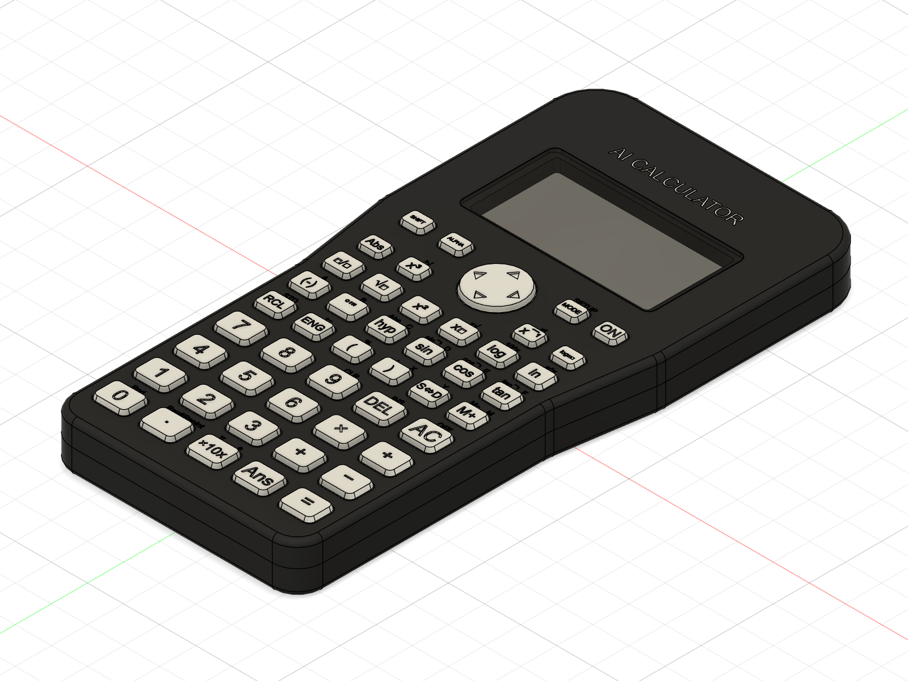
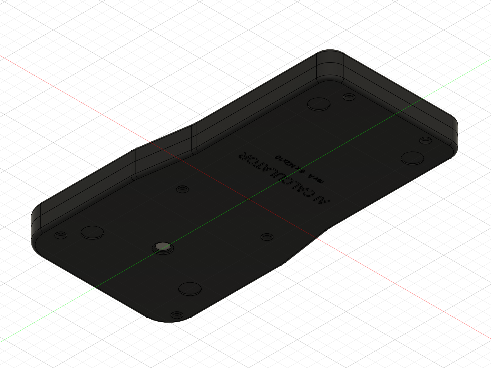
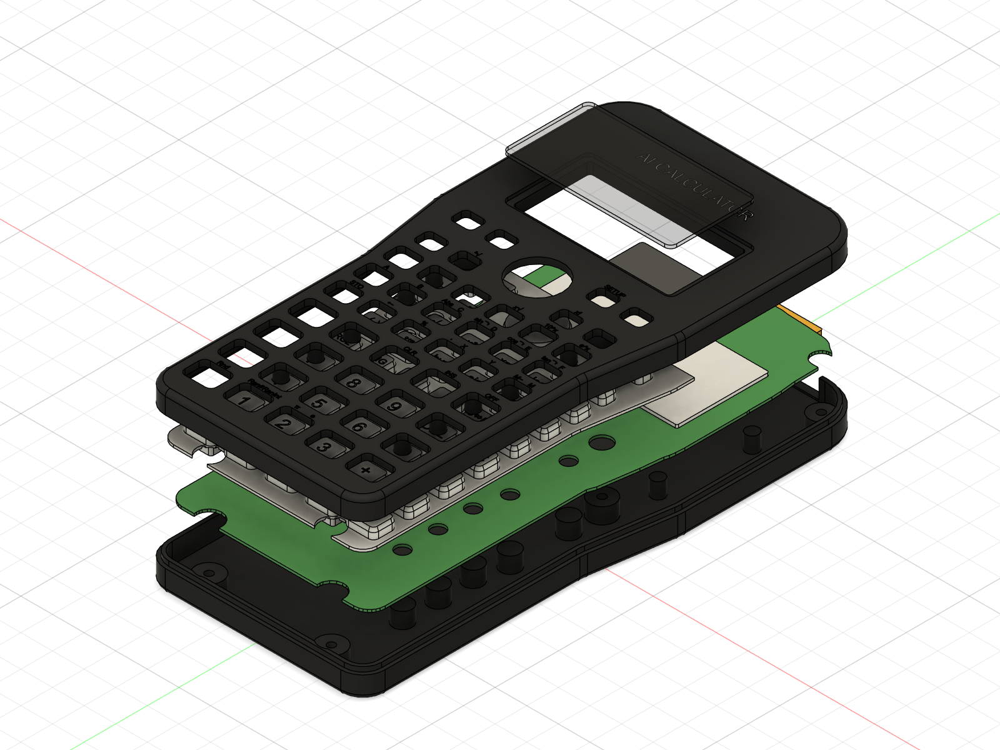
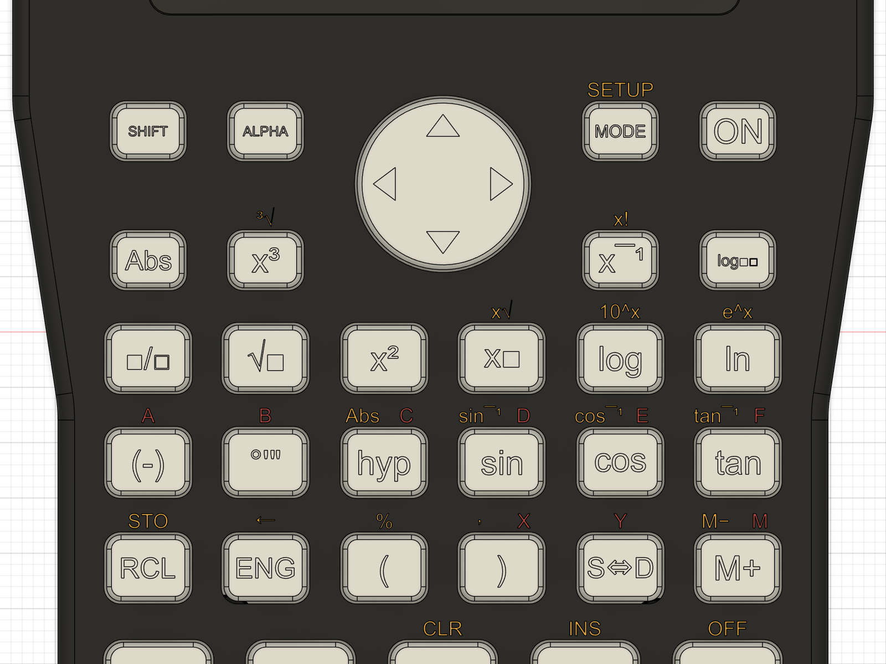
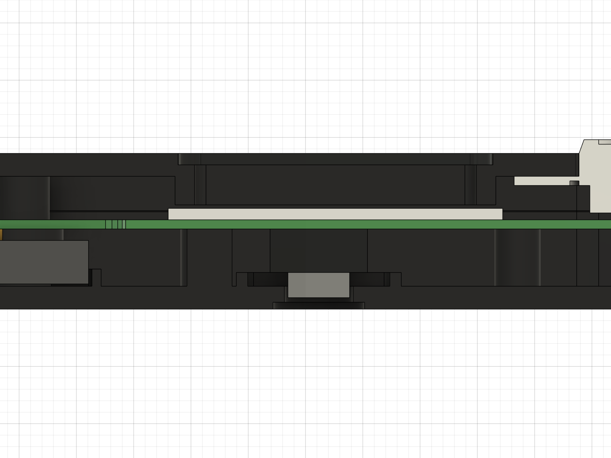
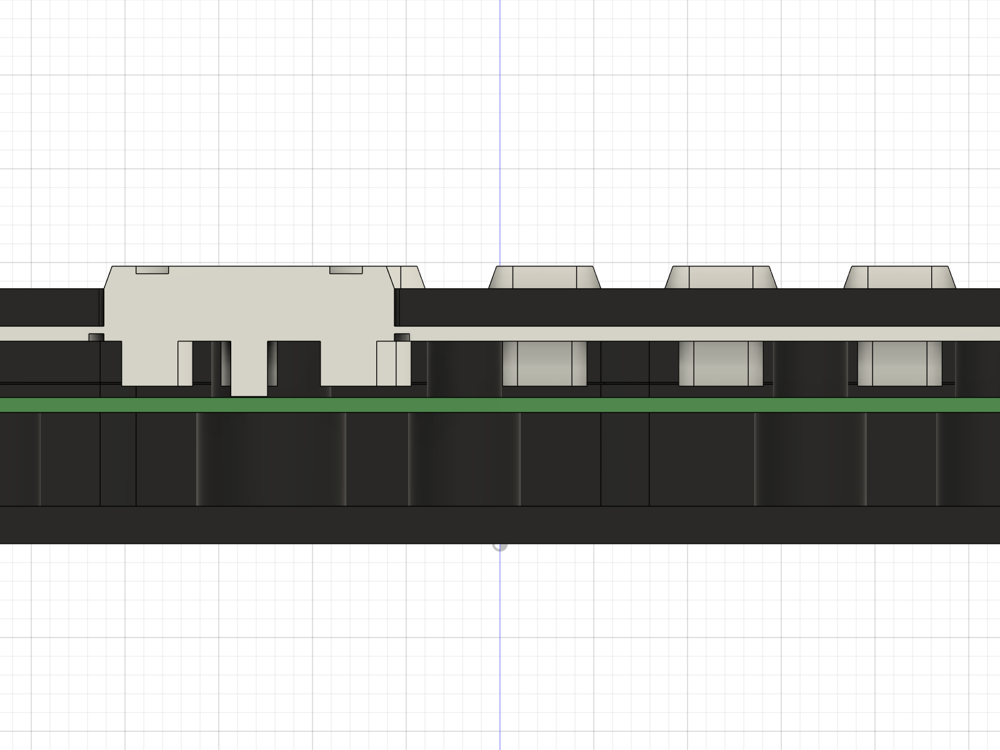

# AI Calculator custom case (rev A concept)

> **Shell switch (2026-10-02):** Nirav now uses a **Casio fx-115ES** shell, not the fx-300ES Plus. Same key grid, but it has paired screw posts (not 12 pegs), stubs on the side walls beside the screen, and rings and ribs in the back cover. The geometry below is still from the fx-300ES scan: the post holes, outline and key pads must be re-derived from the new readings and a flatbed scan (measurement sheet C7–C15, F6) before ordering.

A 3D-printable replacement for the fx-300ES PLUS shell, generated in Fusion 360
straight from the KiCad board (`hardware/kicad/ai_calc.kicad_pcb`). The board
was laid out to drop into the original Casio shell; this case keeps every
Casio mounting point (screw posts, locating pegs, back-cover pins), so the same
board fits both.

| Front | Back | Exploded |
| --- | --- | --- |
|  |  |  |



| Section through display and camera | Section through REPLAY and keys |
| --- | --- |
|  |  |

## fx-115ES shell (2026-10-03)
`build_case.py` now copies the **fx-115ES** shell, with no Casio branding:
- **Outline:** `fx115es_outline.json`, traced from Nirav's back-cover photo (fitted on its 6 screw holes, 0.31 mm RMS) and scaled to the caliper readings: **79.3 × 161.0 mm**, **13.8 mm** thick.
- **Screws:** six screws at the fx-115ES spots (row-1 pair, bottom pair, top corners from C11).
- **Pins:** locating pins at the real 3.85 mm post size.
- **Key openings:** the measured fx-115ES sizes, with oval top-row keys and a Ø 15.4 round pad.
- **Window:** 60.65 × 24.3 at the C13 position.
- **Solar window:** kept as a shallow decorative panel.
- **Label:** "AI CALCULATOR" where the Casio logo sits.

`python build_case.py` checks it offline (board-to-wall gap ≥ 0.5 mm, e-paper centred in the window). The 3D build needs Fusion open with the bridge add-in.

## What's in it

- **Casio silhouette** from the board: wide top, short taper, narrow bottom; 77.7 × 156.2 × 13.6 mm.
- **Two-part shell** split at the board's back face, with a 1.1 mm tongue-and-groove lip and 1.5 mm rounded edges.
- **Six M2 screws** at the original Casio screw posts (two through the board, two in its bottom notches, one in the LR44 notch, one in the battery cut-out), plus 10 locating pins through the board's Ø4.4 peg holes and 5 back-cover pins pressing the board under the display.
- **Display:** flush 1 mm acrylic lens in a front recess, window sized to the e-paper's active area (49.5 × 24.6 mm), and a frame that holds the panel against the board.
- **Keymat:** one TPU piece with 46 bevelled caps and a REPLAY rocker (centre pivot, four plungers). Each cap has a thinned hinge ring so the sheet flexes, a plunger 0.6 mm above its carbon pad, and a 0.3 mm debossed legend.
- **Face legends:** SHIFT functions (yellow) and ALPHA letters (red) above the keys, from the firmware's key table, debossed 0.25 mm and modelled as paint fill.
- **Back cover:** camera window with a chamfered bezel and a module guide, a LiPo cradle with a lead gap, a slot for the magnetic connector, counterbored screw holes, pockets for four 8 mm feet, and the label.
- **Interference check:** 0 overlaps between shells, keymat, lens, PCB, e-paper, battery, camera and connector.

## Regenerate

Fusion 360 must be open with the FusionMCPBridge add-in running
(`../../../fusion360-mcp-bridge`). The whole build takes about 3 minutes:

```bash
python build_case.py
```

```bash
python fusion_run.py build_case.py all
```

The first command is an offline check of the outline against the board; the
second runs every stage in order (shells, front, back, keymat, legends,
faceplate, parts, check, export) in a new Fusion document and closes earlier
builds. Single stages and pictures:

```bash
python fusion_run.py build_case.py stage=shots "views=iso_front,front,back,top@0;0;60"
```

```bash
python fusion_run.py build_case.py stage=section x=0.2 "views=left,detail@45;7;40"
```

```bash
python fusion_run.py build_case.py stage=explode gap=14
```

`gap=0` puts the exploded view back together. Progress goes to `build.log`
(the bridge stops waiting after 30 s, Fusion doesn't).

All dimensions are parameters at the top of `build_case.py`. Board features are
read from the KiCad layers each time, so moving a key pad or the camera in KiCad
moves it in the case too.

| KiCad source | Used for |
| --- | --- |
| `Edge.Cuts` | board outline, case outline (0.5 mm clearance + 2.2 mm wall), bottom screw notches |
| `KEYPADS` (User.2) | 46 key holes, caps and plungers, REPLAY pad |
| `KEEPOUTS` (User.3) | e-paper, active area, camera hole, battery bay, magnetic connector, 5 back-cover pins |
| `VERIFY` (User.1) | the two top screw positions |
| `Post_Hole_4.4` / `ScrewBoss_Hole_6.0` footprints | 10 locating pins, 2 middle screws |

## Parts

| Part | Make it from | Notes |
| --- | --- | --- |
| Front shell | PETG / ASA / resin, face down | 2 mm plate, flush lens recess, debossed name |
| Back cover | PETG / ASA / resin, outside down | 2 mm floor, lip that keys into the front shell |
| Keymat | TPU 95A | one piece: sheet + caps + plungers, thinned hinge ring round each cap |
| Lens | 1 mm clear acrylic, laser cut (`export/lens_1mm_acrylic.dxf`) | glue into the front recess |
| Screws | 6 × M2 × 10 pan head, self-tapping into plastic | from the back |
| Feet | 4 × 8 mm self-adhesive bumpers | pockets in the back |

## Stack-up (Z from the back face)

| Z (mm) | What |
| --- | --- |
| 0 – 2.0 | back floor (camera window, counterbores, feet pockets) |
| 2.0 – 7.0 | components on the board's back side: ESP32-S3, camera, battery (3.8 mm) |
| 7.0 | parting line = PCB back face; back bosses and posts stop here |
| 7.0 – 7.8 | PCB (0.8 mm) |
| 7.8 – 8.8 | e-paper (1.0 mm, check the real panel) |
| 8.4 | plunger tips (0.6 mm key travel to the pads) |
| 9.1 – 11.6 | display frame pressing the e-paper |
| 10.8 – 11.6 | keymat sheet |
| 11.6 – 13.6 | front plate |
| 14.8 | key cap tops (1.2 mm proud) |

Total 77.7 × 156.2 × 13.6 mm (the Casio is 80 × 161 × 13.8).

## Printing

| Part | Orientation | Settings |
| --- | --- | --- |
| Front shell | face down on a textured or smooth PEI sheet | 0.2 mm layers, 3 walls, 20 % infill; the face comes out flat and clean. Key holes and the lens recess need no supports. |
| Back cover | outside down | same; the lip prints upright, no supports |
| Keymat | sheet down | TPU 95A, 0.15 mm layers, slow (20–25 mm/s), 100 % infill; the plungers print on top of the sheet without supports. Legends are 0.3 mm deep: fill them with paint and wipe, or print with a colour change at Z = 14.5 mm. |

Resin printing gives a much nicer front face; scale nothing, all clearances are already in the model
(0.5 mm board-to-wall, 0.25 mm per side cap-to-hole, 0.1 mm on the lip).

## Assembly

1. Glue the 1 mm acrylic lens into the front recess (thin bead of UV glue or 0.1 mm VHB tape round the edge).
2. Drop the keymat into the front shell, caps through the holes. The locating pins and screw columns pass through its holes.
3. Fit the e-paper on the board, then lay the board face down on the pins (the ten Ø4.4 holes) so the display sits under the frame.
4. Battery into its cradle on the back cover, leads out through the gap at the right-hand end.
5. Close the back cover (the lip keys into the front shell's groove) and fit 6 × M2 × 10 self-tapping screws.
6. Stick four 8 mm bumpers into the pockets.

## Check on real hardware

Most of these come straight from the board's VERIFY layer; the case has a knob for each one.

| # | What | Where to change it |
| --- | --- | --- |
| 1 | E-paper module thickness (1.0 mm assumed) and whether the frame should press its glass or only its border | `EPD_T`, display frame in `stage_front` |
| 2 | Key travel: 0.6 mm from plunger to pad through a 0.4 mm TPU hinge. Print one row first. Too stiff: thinner hinge or wider ring; too loose / double presses: raise `TRAVEL`. | `TRAVEL`, hinge cut in `stage_keymat` |
| 3 | Magnetic connector height (V5). The slot is 22 × 6 mm in the top wall, Z 2.5 to 8.5. | magnet slot in `stage_back` |
| 4 | Camera module depth (V6). Back cavity is 5 mm; the guide ring assumes a 12 × 12 keep-out and a Ø6 lens window. | `cam_ko`, camera guide |
| 5 | Battery 3.8 mm thick (V3). The cradle gives 31.6 × 12.1 mm and 5 mm of height. | battery cradle |
| 6 | Tallest part on the back of the board (ESP32-S3-MINI-1 is 2.4 mm; the 5 mm cavity has room). | `Z_SPLIT`, `FLOOR` |
| 7 | BOOT button: no access hole yet because it isn't placed on the board. Add a Ø2 pin hole in the back once it is. | `stage_back` |
| 8 | Wi-Fi: the ESP32-S3 antenna works fine through plastic; keep any metal paint or foil off the case near it. | – |
| 9 | Screws: M2 self-tappers into 1.7 mm pilots. For many open/close cycles use M2 heat-set inserts (3.2 mm holes, change `PILOT_D`). | `PILOT_D` |
| 10 | **Key layout mismatch:** the board's second row is Abs, x³ │ x⁻¹, logₐb (the real fx-300ES PLUS), but the firmware key table (`sim/web/page.html` TOP) has x⁻¹, nCr │ Pol, x³. The case follows the board. Change one or the other before printing the keymat. | `FACE`, `LEGENDS`, firmware key table |
| 11 | Small legends: SHIFT/ALPHA/MODE caps get ~1 mm text and the face labels are 1.3 mm. That's fine for resin or paint fill, marginal on FDM. | `FACE_H`, `glyph_width` |

Material (solid volume): front shell 19.9 cm³ (≈25 g PETG solid, ~15 g printed),
back cover 30.6 cm³ (≈39 g solid, ~22 g printed), keymat 16.4 cm³ (≈20 g TPU).

## Files

| File | What |
| --- | --- |
| `build_case.py` | the whole design, generated from KiCad (parameters at the top) |
| `fusion_run.py` | sends a script to Fusion through the FusionMCPBridge add-in |
| `export/ai_calc_case.step` | full assembly (shells, keymat, lens and reference parts) |
| `export/ai_calc_case.f3d` | Fusion archive with the timeline (open in Fusion, edit any feature) |
| `export/*.stl` | print files |
| `export/lens_1mm_acrylic.dxf` | laser-cut file for the window |
| `renders/` | screenshots of the current build |
