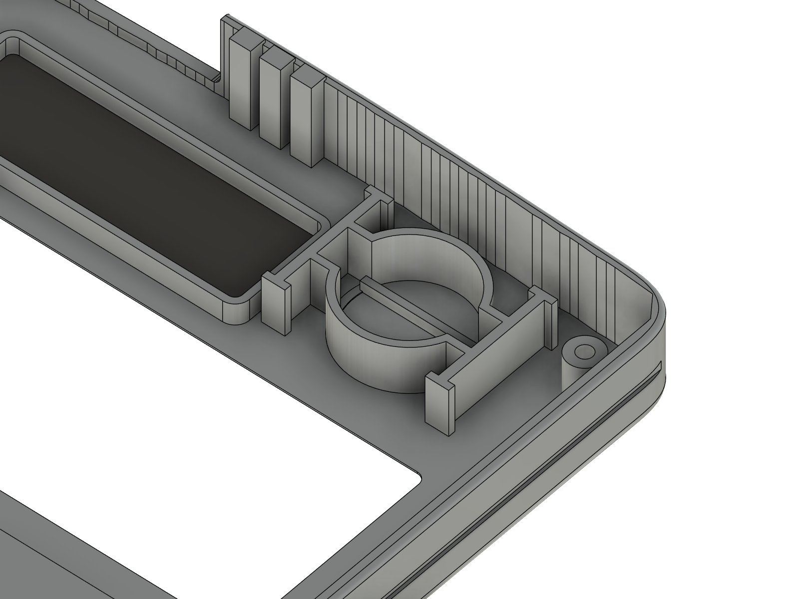
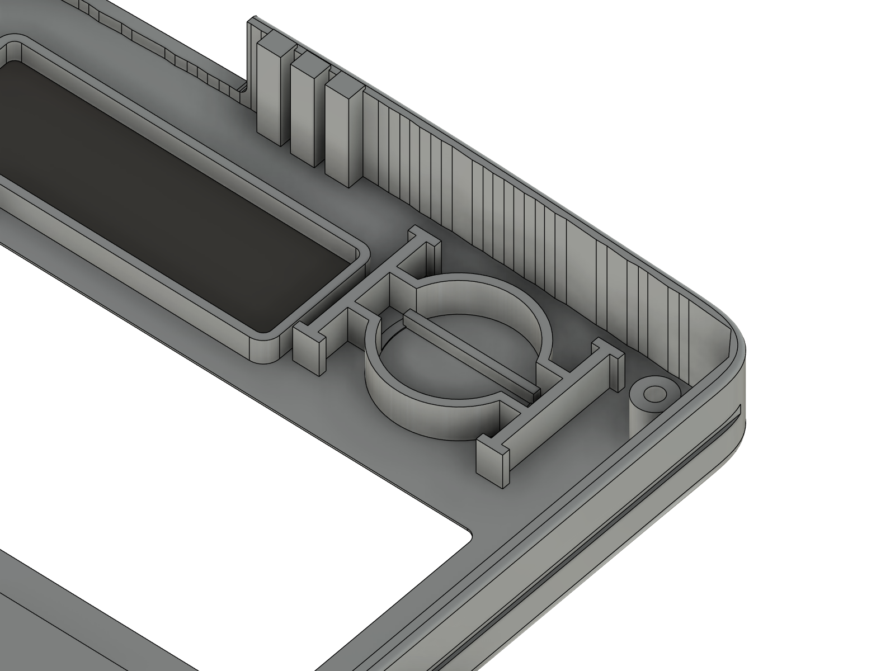
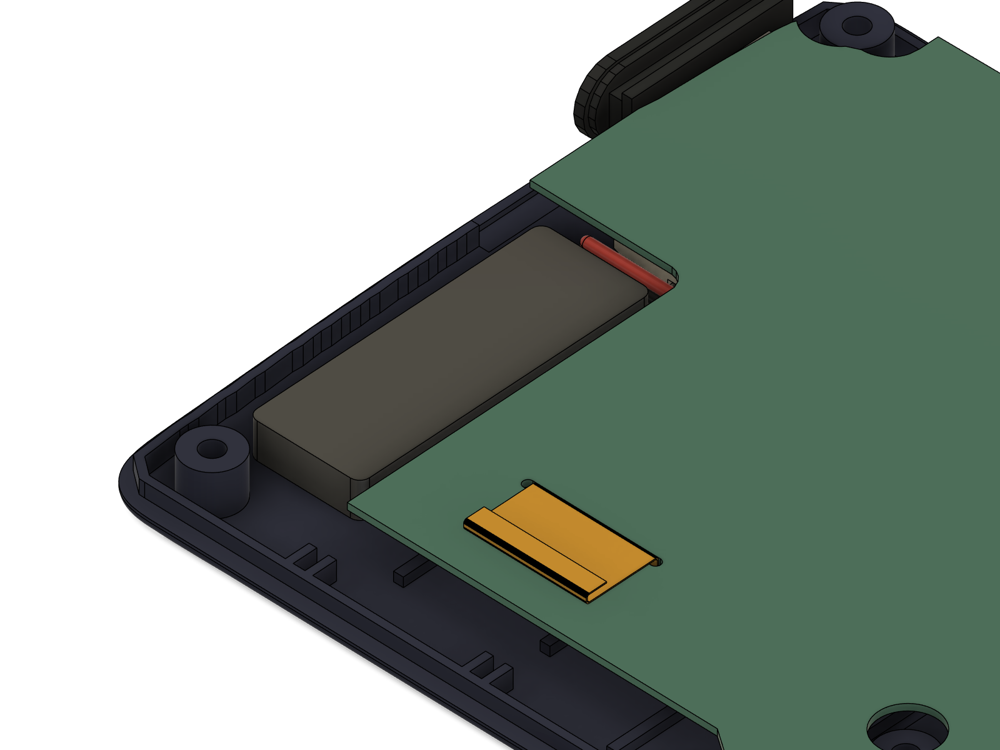
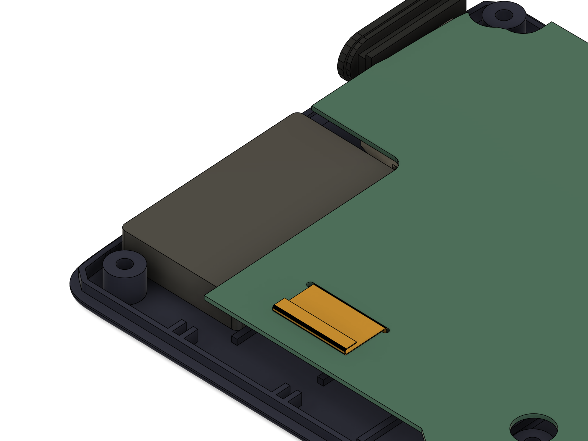
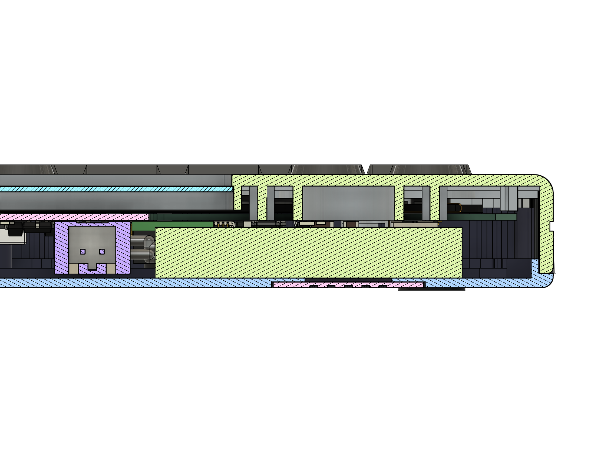
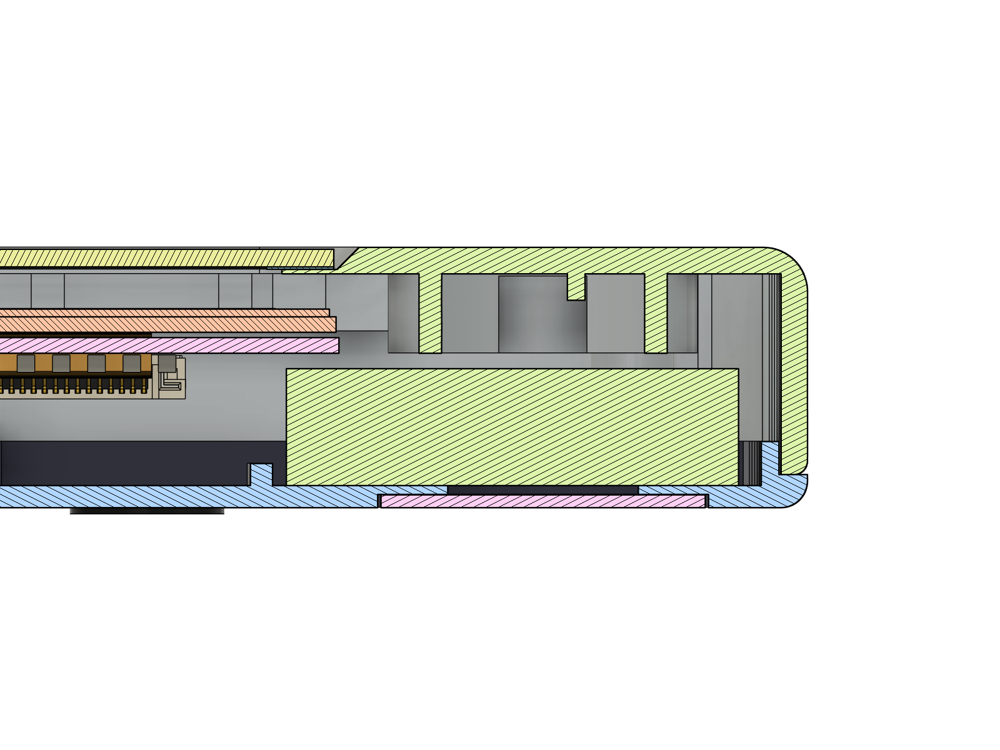

# Battery upgrade study: a bigger LiPo without changing the board (2026-10-06)

**Question.** Does grinding out the LR44 coin-cell holder in the fx-115ES faceplate leave room for a bigger LiPo than
today's Adafruit #1570 (100 mAh, 31 × 11.5 × 3.8 mm)? Which cells fit? And how much hand work per unit does each
grind cost once orders come in?

**Short answer.**
1. Even **without touching the holder**, the corner has room for a 3.8 mm cell of **33.5 × 20.7 mm** (today's cell
   uses 31 × 11.5). The **Adafruit #1317, 150 mAh** (26.0 × 19.75 × 3.8, same price and plug) fits with **≥ 0.3 mm
   all round**. That's **+50 % with no extra grinding.**
2. Removing the holder completely isn't worth it. **Cutting 1.9 mm off the holder's tips** is enough. The board
   (at Z 7.0) then limits the height, so the envelope becomes **33.5 × 20.7 × 5.7 mm** and a **502030 cell (250 mAh,
   +150 %)** fits. With the trim sled (jig C) that's about **1.5 min per unit**; freehand it's about 5 min.
3. A **custom drop-in shell** has a far bigger pocket: **70 × 41 × 5.4 mm under the keypad**. It takes a
   **1200 mAh** (Adafruit #258) or **1500 mAh** (504060) cell. That's **12–15 ×** today, with no board change (J4 plus a
   longer JST-PH lead). At the board's 50 mA charge current, though, a full charge would take a day or more (see section 5).

Everything below was checked twice: by the raster study `battery_envelope.py` (offline, 0.1 mm grid) and by a
3D boolean check in Fusion (`build_final_assembly.py cell ...`, results in `battery_fit_fusion.json`).

---

## 1. The space: battery envelopes (all clearances ≥ 0.3 mm; the cell lies on the back-cover floor)

Frame: front view, X right, Y up, Z = 0 at the outside of the back cover. **KiCad x = 150 − X, y = 138.94 − Y.**
Floor top is Z 1.0. The board's component face is at Z 7.0.

| Shell | Largest box (L × W × H) | Where (front view) | KiCad (x, y) | Z | What limits it |
| --- | --- | --- | --- | --- | --- |
| **Rev D as built (holder stays)** | **33.5 × 20.7 × 3.8** | X −30.9…2.6, Y 58.2…78.9 | x 147.4…180.9, y 60.0…80.7 | 1.0–4.8 | top: LR44 holder (its bottom is Z 5.1); left: corner screw boss; right: lead channel to J4; bottom: upper rib A; top end: comb snap teeth / lip |
| Rev D, taller but narrower | 10.2 × 20.7 × 5.7 | X −7.6…2.6, Y 58.2…78.9 | x 147.4…157.6 | 1.0–6.7 | holder I-bar on the left, board on top |
| **Holder trimmed to Z 7.0 (1.9 mm off)** | **33.5 × 20.7 × 5.7** | X −30.9…2.6, Y 58.2…78.9 | x 147.4…180.9, y 60.0…80.7 | 1.0–6.7 | top: **board** (Z 7.0) and the trimmed holder; sides as above |
| Holder removed (0.2 stub left) | 33.5 × 20.7 × 5.7, or 32.4 × 17.6 × 6.8, or 23.4 × 18.2 × 9.1 | X −30.9…−7.5, Y 61.1…79.3 for the 9.1 box | x 157.5…180.9, y 59.6…77.8 | 1.0–10.1 | solar-window frame (Z 8.1), plate (Z 10.6), board edge |
| **Custom drop-in shell** (no ribs / holder / solar box) | **70.0 × 41.2 × 5.4** under the keypad | X −35…35, Y −68.5…−27.3 | x 115…185, y 166.2…207.4 | 1.0–6.4 | locating posts (end at Z 6.7), board F-side parts above Y −27 (U5, R8–R19), bottom screw bosses, wall |

**So the full removal only gains boxes that are 6.8–9.1 mm thick but under 18 mm wide.** Real cells that thick are
also wider (802030, 902025 …), so they don't fit. Trimming the holder gets every practical cell that removal would.

Height maps (grey = no room, red < 3.8, amber 3.8–5.7, green 5.7–6.8, blue > 6.8 mm free above the floor):
`renders/battery_upgrade/envelope_revD.png`, `envelope_lr44_trim.png`, `envelope_lr44_ground.png`, `envelope_custom.png`.

The **lead exit is reserved**: a 1.5 mm channel on the −X side of J4 and 3 mm in front of the plug stay free, so the
cell's leads can leave its **+X end (the end towards J4)** and drop into the JST-PH plug (plug at front-view X 8.4,
opening towards −Y). Any lead of 50 mm or more reaches. Coil the spare length under the board between the plug and
rib A, not on top of the cell.

---

## 2. Candidate cells (dims include the protection board (PCM) and tape; "margin" = gap per side incl. the 0.3)

| Cell | mAh | L × W × T (mm) | Source / price / shipping | Rev D (holder) | Holder trimmed | Custom shell |
| --- | --- | --- | --- | --- | --- | --- |
| Adafruit #1570 (today) | 100 | 31 × 11.5 × 3.8 | adafruit.com/1570, $5.95, in stock | side 1.75 / 1.8, top **0.30** | top 2.2 | fits |
| **Adafruit #1317** | **150** | 26.02 × 19.75 × 3.8 | adafruit.com/1317, **$5.95**, in stock, 2–5 days | side **2.6 / 1.0**, top **0.30** ✔ (Fusion: 0 overlaps, 0.30 to holder, 2.2 to board) | top 2.2 | fits |
| Adafruit #1317 as shipped | 150 | +~1.1 where the lead is taped on top (4.9) | — | **no** (peel the tape, lead off the end) | ✔ | ✔ |
| Alibaba custom **352033** | ~180 | 33 × 20.3 × 3.6 | Alibaba, ~$1.5–2.5 at MOQ 100–500; samples 1–2 wk, batch 3–5 wk + air 1–2 wk | side 0.55 / 0.50, top 0.50 ✔ | ✔ | ✔ |
| 402030 (generic) | ~200 | 32 × 20.5 × 4.2 | Amazon ~$4 ea / Alibaba | no (4.2 > 3.8) | side 1.05 / 0.40, top 1.8 ✔ | ✔ |
| **EEMB 502030** | **250** | 32 × 20.5 × 5.3 (EEMB) | Amazon US **B08VRZTHDL** (4-pack, Prime 1–3 days, ≈ $4–6 per cell; listing says *confirm polarity*) | no | **side 1.05 / 0.40, top 0.70 ✔** (Fusion: 0 overlaps) | ✔ |
| Generic 502030, worst case | 250 | 33.0 × 20.5 × 5.2 (Melopero datasheet) | Amazon (Liter, AKZYTUE, MakerHawk, Qimoo) | no | side 0.55 / 0.40, top 0.80 ✔ (Fusion, 33 × 20.5 × 5.3: 0 overlaps, 0.48 to the faceplate, 0.70 to the board) | ✔ |
| Alibaba custom **552033** | ~300 | 33 × 20.3 × 5.5 | Alibaba custom, ~$1.5–3 at MOQ 200–500, 4–7 wk total | no | side 0.55 / 0.50, top 0.50 ✔ (Fusion: 0 overlaps, 0.5 to board) | ✔ |
| 601230 / 501535 | 200 / 220 | 32 × 12.5 × 6.2 / 37 × 15.5 × 5.2 | generic | no | no / no | ✔ |
| Adafruit #4237 / #2750 / #4236 | 350 / 350 / 420 | 32.5 × 25 × 5.0 / 36 × 19.6 × 5.2 / 35 × 24 × 5.2 | adafruit.com, $5.95–6.95 | no | **no** (too wide or too long) | ✔ |
| Adafruit #1578 | 500 | 36 × 29 × 4.75 | adafruit.com, $7.95 | no | no | ✔ |
| **Adafruit #258** | **1200** | 62 × 34 × 5.0 | adafruit.com/258, **$9.95**, in stock | no | no | **side 4.6 / 5.2, top 0.70 ✔** |
| **Alibaba 504060** | **~1500** | 62 × 40.5 × 5.2 | Alibaba stock size, ~$3–5 at MOQ, 3–6 wk | no | no | **side 4.3 / 0.68, top 0.50 ✔** |
| Adafruit #2011 / #3898 | 2000 / 400 | 60 × 36 × 7.0 / 36 × 17 × 7.8 | adafruit.com | no | no | **no** (too thick) |

Best placements (from `battery_envelope.json`; the Fusion checks used these):
- #1317 in rev D: centre **front (−15.6, 68.7) = KiCad (165.6, 70.24)**, long side along X, Z 1.0–4.8.
- 502030 / 552033 with the trimmed holder: centre **front (−14.15, 68.55) = KiCad (164.15, 70.39)**, long side along X,
  PCM / lead end towards J4 (+X), Z 1.0–6.3/6.5.
- Custom shell: centre **front (0, −45.4…−47.9) = KiCad (150, 184.3…186.8)**, long side along X.

**Plug and polarity.** J4 is a JST-PH 2.0 socket wired for Adafruit's polarity (red = +). Adafruit cells plug straight
in. **Amazon / Alibaba PH2.0 cells are often reversed.** Before plugging one in, hold its plug next to a #1570 plug,
latch up: the red wire must be on the same side. If it isn't, lift the two crimp latches with a needle and swap the
pins. Q1 (AO3401A) protects the board from a reversed cell, but nothing works or charges until the pins are swapped.
For an Alibaba order, put it in writing: "JST PH2.0 plug, red = + on pin 1 as Adafruit #1570, lead 60 mm (custom shell: 150 mm), 28 AWG, PCM included, UN38.3".

---

## 3. Hand time per unit for each grind (estimates; Dremel freehand vs. with the printed jigs in `../jigs/`)

| Zone | Part | What | Dremel freehand | With jig | Jig |
| --- | --- | --- | --- | --- | --- |
| 1 solar_box | navy back cover | frame + grid (34.6 × 13.6, 5–5.5 tall) flat to the floor | 8–12 min | **3–4 min** | A plate + A3 gauge (router base, bit stops 0.2 above the floor) |
| 2 rib_b | navy back cover | 14–16 mm of a 1 mm rib flat, over the camera | 2 min | **0.5–1 min** | A plate (16 mm hole); scrape the last 0.2 with a knife |
| 3 camera_window | navy back cover | 7 mm hole through the 1 mm floor | 4–5 min (measure, mark, pilot, step drill, deburr) | **1–1.5 min** | A2 drill bush (2 mm pilot on centre), then step drill from outside |
| 5 + 5b magnet_slot (grinding-guide zone numbers; was "4" here) | silver faceplate + navy lip | U-notch 21.5 × 7.95 in the top wall + same width through the lip | 10–15 min | **4–5 min** | B saddle (saw along its window, file to its bottom edge); lip: 2 snips + snap, 0.5 min |
| **today's total** | | | **≈ 25–34 min** | **≈ 9–11 min** | |
| 4a LR44 trim (upgrade; guide zone 4 = the cup, kept) | silver faceplate | holder tips cut 1.9 mm (to 5.5 below the rim) | 4–6 min | **1–1.5 min** | C sled (sandpaper tongue, stops itself on the rim) |
| 4b LR44 removal | silver faceplate | holder down to a 0.2 stub; right I-bar is 0.85 mm from the solar frame | 8–12 min, high risk of nicking the frame | 3–4 min | (not provided: no benefit over 5a) |

Setting up a jig is part of the times above. Batching helps more: clamp the router depth once and do 10 back covers in a row.

---

## 4. Recommendation (production time in mind)

Coordinator's lean: *keep the LR44 holder + 100 mAh for the prototypes / donor shells (no extra grind), and design the
bigger cell into the future drop-in shell.* **I agree, with one free change: fit the 150 mAh #1317 instead of the 100 mAh.**

| Option | Capacity | Extra time / unit | Risk | Verdict |
| --- | --- | --- | --- | --- |
| Holder stays, #1570 | 100 mAh (1 ×) | 0 | none | works, but the smallest cell has the worst sag (section 5) |
| **Holder stays, #1317** | **150 mAh (1.5 ×)** | **≈ 20 s** (peel the lead tape, lead off the +X end) | none; same 0.30 mm under the holder as today; same price and plug | **do this for donor shells now** |
| Holder stays, custom 352033 | ~180 mAh (1.8 ×) | 0 | supplier lead time, polarity spec | for a 100+ unit batch |
| Holder trimmed 1.9 mm + 502030 | 250 mAh (2.5 ×) | 1–1.5 min with jig C (5 min freehand); ≈ +13 % on the jigged grind time | low: no XY cutting, the plate is never touched, flat stop on the rim | only if testers ask for battery life before the custom shell exists |
| Holder trimmed + custom 552033 | ~300 mAh (3 ×) | same as above | low | same |
| Holder removed | no practical cell gains over the trim | +3–4 / 8–12 min | nicks the solar frame (0.85 mm away) | **don't** |
| **Custom drop-in shell, keypad pocket** | **1200 mAh (#258, 12 ×) – 1500 mAh (504060, 15 ×)** | 0 (pocket printed / moulded) | needs a 150 mm lead (or a JST-PH extension) and, ideally, R2 changed in v15 | **the production answer** |

**The custom shell's largest practical cell:** an **Alibaba 504060, ~1500 mAh, 5.2 × 40.5 × 62 mm incl. PCM**,
lying on the floor under the keypad (pocket 70 × 41.2 × 5.4: margin 4.3 per side along X, 0.68 along Y, 0.5 on top).
The off-the-shelf choice is the **Adafruit #258, 1200 mAh, 62 × 34 × 5.0, $9.95**, which has more margin.
Keep these clear when you design the pocket:
- the camera module and its ribbon corridor (front X −6.25…6.25 from J1 up to the module);
- the board parts above Y −27 (U5, R8–R19, J1);
- the bottom screw bosses (±19.5, −71.65);
- the locating posts. They end 0.3 under the board; end them flush and the pocket gets 5.7 tall.

Route the lead up the left side on the floor, past J2, then across at Y ≈ 55 to the plug. That's ≈ 120–130 mm, so
specify a **150 mm lead**, or use a JST-PH extension (Adafruit #1131, 500 mm, cut and re-crimp).

---

## 5. Charging and brown-out

**Charge time (no board change).** R2 = 20 kΩ sets the MCP73831 to 1000 V / 20 kΩ = **50 mA**. That charges a bigger
cell, just more slowly: about capacity / 50 mA plus ~15 % for the constant-voltage tail.

| Cell | 100 | 150 | 250 | 300 | 1200 | 1500 mAh |
| --- | --- | --- | --- | --- | --- | --- |
| Full charge at 50 mA | ≈ 2.3 h | ≈ 3.5 h | ≈ 6 h | ≈ 7 h | ≈ 28 h | ≈ 35 h |

**v15 board note (not now):** make R2 match the cell. 10 kΩ → 100 mA, for 250–300 mAh cells (≈ 3 h, 0.3–0.4 C).
4.7 kΩ → 213 mA, for the 1200–1500 mAh custom-shell cell (≈ 6.5–8 h, ≈ 0.15–0.2 C). At 213 mA the charger burns
≈ (5 − 3.7) × 0.21 ≈ 0.28 W. The MCP73831 throttles itself if it runs hot, so that's fine on the SOT-23-5. Changing
R2 only pays off together with the custom shell; for the donor shells, 50 mA is fine.

**Brown-out.** The ESP32-S3's Wi-Fi bursts draw ~300–350 mA. A small pouch cell's internal resistance (incl. its
protection board) is roughly 0.5–0.8 Ω at 100 mAh, 0.25–0.35 Ω at 250 mAh and 0.1–0.15 Ω at 1200 mAh. The voltage
drop on each burst is therefore ≈ 0.2–0.28 V, ≈ 0.1 V and ≈ 0.04 V. With the 100 mAh cell, a burst late in the
discharge can pull the RT9080 3.3 V regulator out of regulation and reset the chip, which strands usable charge.
350 mA is also 3.5 C for a 100 mAh cell but 1.4 C for 250 mAh. So a bigger cell gives more than its capacity ratio:
fewer brown-out resets near empty, and less stress on each burst.

---

## 6. The LR44 trim zone (spec, for the battery upgrade only)




(Inside of the silver faceplate, face down; `lr44_holder_before.png` / `_after.png` are the straight-down views.)

- **Outline (where to work):** a rectangle over the whole holder (ring, I-bars, lugs, contact rib) = front X −29.0…−7.65,
  Y 62.54…77.34. Measured on the faceplate: **10.65 to 32.0 mm in from the LEFT outer edge** (seen from the front;
  face-down on the bench it is on your right with the top end away from you), and **4.8 to 19.6 mm down from the top
  outer edge**. The model feature is `GRIND lr44_holder (trim)` (`build_final_assembly.py lr44 mode=trim`).
- **Depth:** cut every part of the holder down to **5.5 mm below the rim** (the parting-line face of the faceplate). Its
  tips are now 3.6 below the rim, so **1.9 mm comes off** and the holder stays 3.6 mm tall on the plate. The plate
  (1.2 mm) is never touched. With jig C the sled sits flat on the rim when you're done.
- **Don't touch:** the solar-window frame (0.85 mm to the right of the right I-bar; it stops 1.1 mm short of the trim
  plane, so a flat sanding tongue never reaches it), the corner screw post (3.1 mm left of the zone), the side-wall
  hooks, the comb snap teeth at the top, the magnet notch, the side walls.
- **Full removal (not recommended):** same outline, down to a 0.2 mm stub on the plate (`lr44 mode=remove`); keep
  ≥ 1.2 mm of plate.

**Cell placement (502030 with the trimmed holder):**





(`cell_before_top.png` / `cell_after_top.png`: top views with the faceplate hidden.)

Fit in Fusion (`battery_fit_fusion.json`, 3D boolean + minimum distance against every body):
EEMB 502030 32 × 20.5 × 5.3: **0 overlaps**; faceplate (trimmed holder / snap teeth) 0.48, board 0.70, corner screw 1.5,
J4 2.1, battery lid 0.42 (below the floor line), floor 0 (rests on it).

**Parts list (donor-shell upgrade):**
| Item | Qty / unit | Source |
| --- | --- | --- |
| Cell: Adafruit #1317 150 mAh (no trim) **or** EEMB 502030 250 mAh (with trim) | 1 | adafruit.com/1317 · Amazon B08VRZTHDL |
| Double-sided tape, 0.1 mm, not foam (hold the cell to the floor: 6 × 18 + 4 × 16 mm, off the battery lid) | 2 strips | any |
| Kapton tape, 5 and 10 mm (lead roots on the end face; the folded spare lead) | 2 pieces | any |
| P120 sandpaper + double-sided tape (jig C tongue, ~0.6 mm total) | 1 piece / 20 units | any |
| Jig C (LR44 trim sled), PLA/PETG | 1 per bench | `../jigs/C_LR44_trim_sled.stl` |

---

## 7. How to re-run

```
python battery_envelope.py                         # offline envelopes + fit table -> battery_envelope.json, renders/battery_upgrade/envelope_*.png
python ../build_final_assembly.py lr44 mode=trim   # add the trim feature (mode=remove / off)
python ../build_final_assembly.py cell name=X L=32 W=20.5 T=5.3 X=-14.15 Y=68.55    # candidate + check -> battery_fit_fusion.json
python ../build_final_assembly.py cell name=off    # back to the #1570
```
Rev D (`ai_calculator_final_assembly.f3d/.step`, `interference.json`, `clearances.json`) is unchanged: the `lr44`
and `cell` stages are not part of `all` and nothing was exported with them applied.

Sources: Adafruit product pages 1570, 1317, 4237, 2750, 3898, 4236, 1578, 258, 2011, 1131 (dimensions, prices, stock,
2026-10-06); Amazon listing B08VRZTHDL (EEMB 502030, 20.5 × 32 × 5.3); Melopero 502030 datasheet (5.2 × 20.5 × 33.0).
Alibaba prices and lead times are typical ranges, not quotes.

---

## 8. Placement for the guide (rev E, 2026-10-06: the Adafruit #1317 is now fitted)

Nirav's decision: **#1317 (150 mAh, 26.02 × 19.75 × 3.8), LR44 holder kept, no new grind.** The main model
(`build_final_assembly.py`, `LIPO` / `LIPO_K`) now carries it, and the check passes (assembly_report.md section 9).

**Where it goes.** It lies flat on the floor of the navy back cover, in the top-left corner as seen from the front.
Look into the back cover from the inside with its top end away from you; left and right are then the same as on the
calculator's front.
- Cell: front X −28.61…−2.59, Y 58.83…78.58, Z 1.0–4.8. KiCad x 152.59…178.61, y 60.36…80.11. Centre KiCad (165.6, 70.24).
- **Long side (26 mm) runs left-right.** The **lead end (the edge with the protection board) faces right**, towards
  the middle of the cover and J4.

| Edge of the cell | Landmark Nirav can see | Gap |
| --- | --- | --- |
| left (26 mm cell, short edge) | top-left screw boss (round post, Ø5.5) | **2.6 mm** (3.5 to the screw itself) |
| bottom (long edge) | **rib A**: the first rib running across the cover below the top end | **1.0 mm**, so the cell sits just above rib A |
| top (long edge) | the top wall's inner lip / the comb snap notch | **0.8 mm**, almost against it |
| right (lead end) | J4's body (on the board, once the cover is on) | 7.0 mm |
| — | the old battery-lid opening in the floor (the lid sits in it, its top 0.42 mm below the floor) | the cell bridges over it. The opening starts 4.6 mm in from the cell's left edge, ends 8.9 mm short of its right (lead) edge, starts 5.2 mm above its bottom edge and ends 1.6 mm below its top edge |
| top face | LR44 holder in the faceplate (when closed) | **0.30 mm** in the model (cell straight on the floor); **≈ 0.20 mm** with the 0.1 mm tape under it. The board edge overlaps the cell's bottom 1.9 mm, 2.2 mm higher |

Quick way to place it: push the cell's top edge up to the lip, then slide it until the left edge is a 2.5 mm drill
shank's width from the corner boss. Rib A should then show as a 1 mm sliver below the cell.

**Lead route** (in the model, ≈ 27 mm used; the #1317 lead is 127 mm):
1. From the lead end, go **down** (towards rib A) beside the cell's right edge, then over rib A (it's only 1 mm tall).
2. Turn **right** about 3 mm below the board's top-edge notch (front Y ≈ 55–56).
3. Go along to the plug, and into the **JST-PH plug from below**. The plug's mouth faces down, towards the keypad.
   Red is the right-hand pin as seen from the front (front X 9.4); black is front X 7.4.
4. Fold the ~100 mm of spare into a **flat S of 3 runs (~30 mm each)**, lying on the floor between the cell's lead end
   and J4. The bundle must stay ≤ 4 mm tall (the board is 6 mm above the floor here) and must not cross over J4 or the
   camera ribbon. Hold it with one 10 × 15 mm Kapton strip.

**Tape: 0.1 mm double-sided tape under the cell, no foam.** Use thin double-sided tape (0.1 mm, e.g. tesa 4965 /
3M 9080 type, not foam tape). The cell is held from **below**, so nothing goes on top of it.
- **Keep the tape off the battery lid.** The cell lies over the old lid opening. Tape that touches the lid would rip
  the cell off its leads the day someone opens the lid, and sticky tape would show through the gaps.
  Stick the tape only on the solid floor round the opening. That gives an L of two strips:
  - **Strip 1: 6 × 18 mm**, under the **lead end**, running top-bottom. Its outer edge is 1 mm in from the cell's
    right (lead) edge, and it starts 1 mm above the bottom edge. It stays 2 mm clear of the lid opening.
  - **Strip 2: 4 × 16 mm**, along the **bottom edge**, running left-right. It starts 1 mm in from the left edge and
    **0.5 mm above the bottom edge**, and ends about 2 mm short of strip 1. Its top edge is then 4.5 mm above the
    cell's bottom edge, **≈ 0.7 mm below the lid opening's lowest point** (5.2 mm up).
    *Corrected 2026-10-10:* this said "1 mm above the bottom edge ... stays 0.5 mm below the lid opening", but in the
    model that start leaves only **≈ 0.2 mm** to the opening (`variant_battery_tw302030/results.json`, revE note).
- Put both strips on the **underside of the cell** first (the cell is easier to line up than the floor), peel the
  liners, then lower the cell into place (quick way above) and press for 10 s on the strips only, never in the
  middle over the lid (there's a 0.42 mm air gap under it there).
- The tape lifts the cell 0.1 mm: top Z 4.9, **≈ 0.20 mm under the LR44 holder**. That's enough, but **no foam pad,
  no foam tape, no second layer, and nothing on top of the cell.**
- Tape the cell to the **back cover**, not the board. With the faceplate face down, the cell would otherwise drop
  onto the holder.
**Lead-tape peel tip.** The #1317 ships with its lead **taped down on top of the cell**. Taped there it would be
4.9 mm tall and hit the holder.
1. Peel that tape slowly from the far end towards the lead end, holding the wires flat with a thumbnail **at the
   protection-board edge**. Never let them bend at the solder joints; that's where they snap.
2. Leave the yellow Kapton wrap round the protection board on.
3. Lead the wires straight out of the lead end, and re-tape their roots to the cell's **end face** (not the top) with a
   5 × 10 mm piece of Kapton, so a pull on the lead goes into the tape, not the joints.
4. If the wires on the delivered cell leave from a long (26 mm) edge instead, keep the same position. Lead them round
   the bottom-right corner, between the cell and rib A (there's 1.0 mm), and say so: the guide picture assumes the
   short edge.

**Polarity:** it's Adafruit, so it matches J4 (red = +). It plugs straight in.

## Candidate bulk cell: Taiwoo TW302030 (Alibaba listing, 2026-10-10)

| Item | Value |
| --- | --- |
| Capacity | 140 mAh, 3.7 V |
| Size with PCB | L 30 (+2/−0.5), W 20 ± 0.5, T 3.0 ± 0.3 mm |
| Connector options | 1.0 / 1.25 / 2.0 mm pitch |
| PCM / PCB | customised (3.0 V cut-off available) |

**Against the rev E envelope (33.5 × 20.7 × 3.8):** it should fit (worst case 32 × 20.5 × 3.3), but the width margin is only ~0.2 mm, and it is ~4–6 mm longer than the #1317 towards J4 (≈ 7 mm free there). CAD check: see below.

**CAD check (2026-10-10, v14 and v15, `variant_battery_tw302030/results.json`): fits, with conditions.** Modelled on the
0.1 mm tape at nominal 30 × 20 × 3.0 and worst case 32 × 20.5 × 3.3, leads routed like the #1317's:
- Put it **1 mm further left** than the #1317: left edge ~1.7 mm from the corner post (a 1.5 mm drill shank), top edge
  0.8 mm from the lip. At the #1317's own corner a 32 mm cell pushes the leads, which run down past the lead end, into
  J4's body. With the 1 mm shift: 0 overlaps; worst case leads 0.9 mm from J4, rib A 0.3, LR44 holder 0.7, board 2.6 mm
  (nominal: rib A 0.8, holder 1.0, leads 2.9 mm from J4).
- A cell wider than ~20.3 mm: push its top edge against the lip so it clears rib A.
- The tape L is unchanged (same strips, measured from the new cell's edges; all on solid floor, clear of the lid opening).
  With strip 2 starting 0.5 mm above the bottom edge (§8, 2026-10-10) it is ≈ 0.9 mm (nominal) / 1.4 mm (W 20.5) below
  the lid opening; at the old 1 mm start the model gave 0.4 / 0.9 mm.
- Lead length used ≈ 32–35 mm, so 50–80 mm leads are right. The v15 camera S-fold bay is 27 mm away.
- Picture: `renders/detail/d22_battery_tw302030_ann.png` (both guide folders).

**Order spec:**
- PCM included.
- 2.0 mm JST-PH 2-pin, red (+) on pin 2, black on pin 1.
- 50–80 mm leads.
- UN38.3 + MSDS.
- Meter the polarity of every sample.
