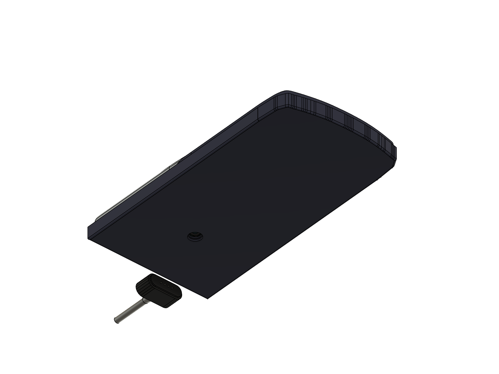
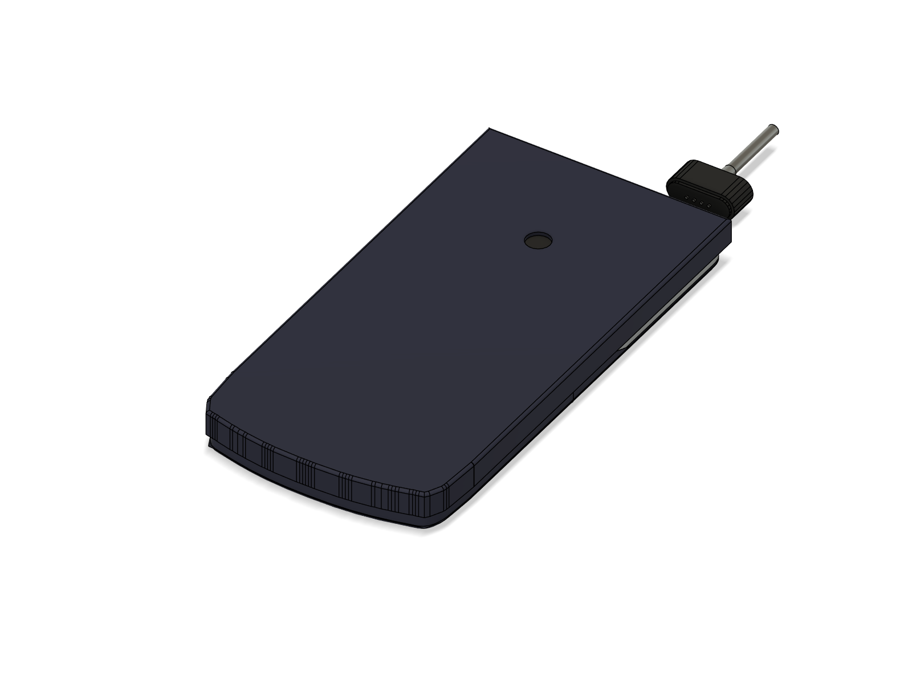

# Slide case mods (LATER: not needed for testing)

> Nirav won't use the slide case while testing. This is for later. Every size of the case itself is a **guess**
> (no photo or measurement of the case yet: see `hardware/QUESTIONS_AND_ISSUES.md`, "CAD (3-part shell + slide case)").
> Re-check the numbers on the real case before drilling.

**How the case is used** (Casio's fx-115ES PLUS guide: "slide its hard case downwards to remove it, and then affix
the hard case to the back of the calculator"): the case's **open end is at the top** (display end) and its closed end
at the bottom, in both positions. Stored: over the face. In use: flipped over and slid onto the back from the bottom.

| Position | Picture |
| --- | --- |
| In use (on the back) |  |
| Hole over the camera |  |
| Stored (over the face) |  |

## Results (model, 2026-10-05, `case_fit.json`)

| Question | Answer |
| --- | --- |
| In use: does the case cover the 7 mm camera window? | **Yes.** The case floor covers the whole back. Needs the hole below. |
| In use: does it cover the magnet face (top-wall U-notch)? | **No.** The open end is at the top, flush with the calculator's top edge; the face and the cable plug are clear (2.5 mm from the case). |
| Stored: does it cover the magnet? | **No**, same open end at the top: the magnet can charge with the case on. |
| Stored: clearances | 0.3 mm over the key tops, 1.4 mm over the lens, 0.05 mm at the rail lips. No overlaps. |
| Extra thickness | +1.5 mm on the back in use (0.3 feet + 1.2 case floor): 13.3 mm at the screen section, 14.3 mm over the keys. Stored: 14.6 mm. |
| Overlaps | 0 in both positions. |

## Zone C1: camera hole in the case (in use)

| | |
| --- | --- |
| Zone name | `case_camera_hole` (the model's feature: `CASE MOD camera_hole`) |
| Hole | **Ø 8.0 mm** through the case floor (case floor 1.2 thick, 0.3 off the back: a 7 mm hole would cut into the lens's field of view at the edges) |
| Drill | 8 mm brad-point or step drill (5/16" = 7.94 is fine). Pilot 2 mm first. Back the floor with scrap wood; drill from the **outside** so the burr is inside. Deburr with a countersink by hand. |
| Position | on the case's **centre line** (40.95 mm from each long outer edge; case 81.9 wide in the model) |
| Along the length | **123.0 mm from the INSIDE face of the closed end** (the bottom of the pocket), which equals **38.3 mm from the open end** if the case is exactly as long as the calculator (162.3 outside in the model) |
| How to measure | Use the inside of the closed end, not the open end (the real case's length is unknown). Better still, transfer it: put a dab of lipstick or dry-erase ink round the camera window on the back cover, slide the case fully on (in-use position), press, slide it off: the mark on the inside of the case floor is the hole centre. Check it is on the centre line, then drill. |
| Check | Slide the case on: you must see the whole 7 mm window through the 8 mm hole, with an even ring all round. |

## Zone C2: magnet

Not needed: the magnet face is at the top wall, and the case's open end is there in both positions.
If the real case turns out to have a closed top end, a **24 × 9 mm** notch (the cable plug's overmould is about
23 × 9) centred **22.5 mm right of the case's centre line** (front view: right of the display; 6.4–27.9 mm from the
right edge of the calculator; the 24 mm notch spans 6.5–30.5 mm from the case's right outer edge), from the floor up
to the wall's edge.

## What the model assumes (all guesses until the case is measured)

Wall 1.0, floor 1.2, 0.3 clearance, lips 0.9 tall riding in a 1.0 × 0.35 groove at Z 5.9–6.9 on both long sides
(one groove serves both positions), straight long sides, closed end following the bottom outline, no finger notch.
Parameters: `CASE_*` and `GROOVE_*` at the top of `build_fx115es_replica.py`; the hole: `CASE_CAM_HOLE_D` in
`build_final_assembly.py`. Re-run: `python build_final_assembly.py case case_check case_renders only=case`.
