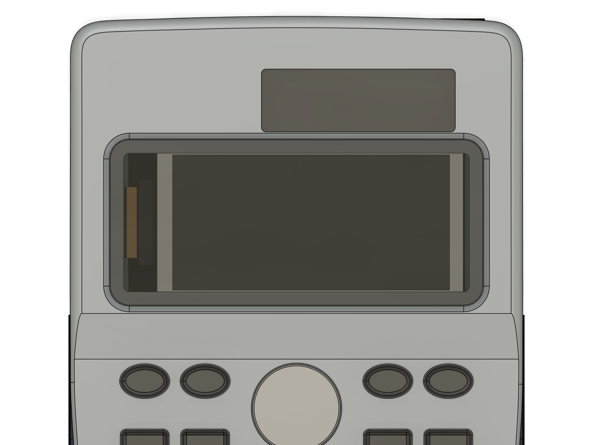
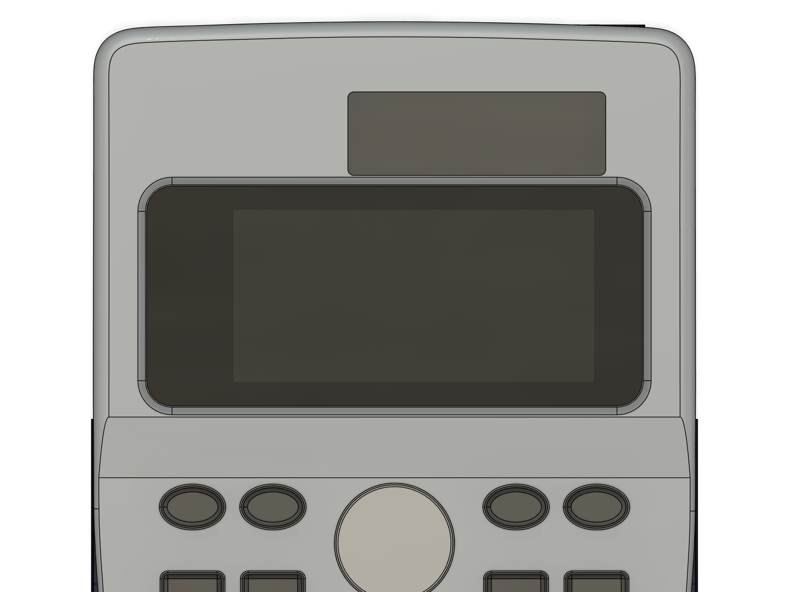

# Window mask (black sticker inside the display lens)

**Why:** through the clear lens you can see the e-paper ribbon's root and fold at the panel's left end, and the
bare glass edges round the picture. A thin matte-black sticker on the **inside** of the lens hides everything
except the e-paper's picture area. No board change.

| Before (no mask) | After (mask) |
| --- | --- |
|  |  |

## The part

| | Value |
| --- | --- |
| Material | matte black vinyl, or matte black sticker / label paper, **0.08–0.15 mm** thick |
| Outer edge | the clear lens's outline: **65.35 × 29.00 mm**, corner radius **3.35** |
| Opening | **47.75 × 22.90 mm**, corner radius 0.3 = the e-paper active area (Waveshare 2.13" V4: 48.55 × 23.70) minus **0.4 mm** on every side, so no white edge shows |
| Opening position | **2.55 mm right of the lens centre**, level (0.00 up), looking at the calculator's face. The active area sits 2.5 mm off the panel's centre (the ribbon end is on the left), so the opening is off-centre on purpose |
| Black bands (face view) | **left 11.35** (ribbon end), right 6.24, top 3.05, bottom 3.05 mm |
| Gap to the panel | the sticker sits 1.79 mm above the e-paper's top film: it never touches or presses on the panel |
| Effect on the lens | the lens sits 0.1 mm higher in its recess (still 0.1 mm below the face) |

Files: **`window_mask_template.svg`** (print, 1:1, A4) and **`window_mask_template.dxf`** (same outlines for a
laser / vinyl cutter, mm, layers `CUT_OUTER`, `CUT_OPENING`, `OPTION_WINDOW`, `MARKS`). Both come from
`window_mask_template.py`, which reads the numbers the final assembly wrote to `placement.json`.

## Steps

1. **Print** `window_mask_template.svg` at **100 %** ("Actual size", never "Fit to page"). Measure the 50 mm bar
   and the 30 mm square with a ruler. If they are off, fix the print setting and print again.
2. **Material:**
   - *Black sticker paper:* print straight onto the matte black sticker sheet (the red cut lines still show), or
   - *Black vinyl:* print on plain paper, tape the paper on top of the vinyl (tape on all four sides) and cut
     through both.
3. **Cut the opening first** (it is the part that must be exact): steel ruler + a **new** craft-knife blade,
   2–3 light passes per side, stop exactly at the corners. Then cut the **outer edge** along the red line
   (the corners are round: go slowly, or use small scissors).
4. **Take the lens out** of the silver faceplate (it sits in the recess round the display window on the outside;
   push it out gently from the inside with a fingertip or lift it with a fingernail at one corner).
   Wipe its inside face with isopropyl alcohol and let it dry.
5. **Which way round:** lay the lens **outside face down** on a clean sheet. You are now looking at its
   inside face, so left and right are swapped: the **wide black band (11.35 mm) must end up on the ribbon side**,
   which, seen from the inside, is on your **right**. Peel the backing and hold the sticker by its edges.
6. **Align:** line the sticker's outer edge up with the lens edges (both are the same shape). The four short
   marks on the template are the centre lines of each lens edge: check they meet the middles of the lens edges.
   Lay one long edge down first, then roll the rest down with a fingertip, from the middle outwards, to avoid
   bubbles.
7. **Check from the front:** hold the lens up to a light with the outside face towards you: the clear opening
   must sit **right of centre**, with the wide black band on the left.
8. Put the lens back in its recess (a thin ring of clear glue or the original adhesive at the edge only, never
   on the opening).
9. **Done when:** looking at the calculator's face you see only the e-paper's picture area inside a black frame:
   no ribbon, no glass edge, no white border.

**No lens removal (option):** cut along the **blue dashed** line instead of the outer red line (60.35 × 24.00).
That smaller sticker passes through the display window from the inside, so it can be stuck on the lens's inside
face with the lens left in place (faceplate open, before the board goes in). Same opening, same orientation rule.

## Checks (model, 2026-10-05)

- Interference: the mask touches only the lens (glued face) and sits 0.01 above the recess ledge. 0 overlaps.
- Opening 47.75 × 22.90 fits inside the window through-opening (60.65 × 24.30) with 0.7 to spare top and bottom.
- Assumed: Waveshare's active area 48.55 × 23.70 (manual) and its centre from the KiCad keep-out (147.445, 92.986).
  If the first test shows a sliver of white on one side, trim that edge of the opening by 0.2 mm.
