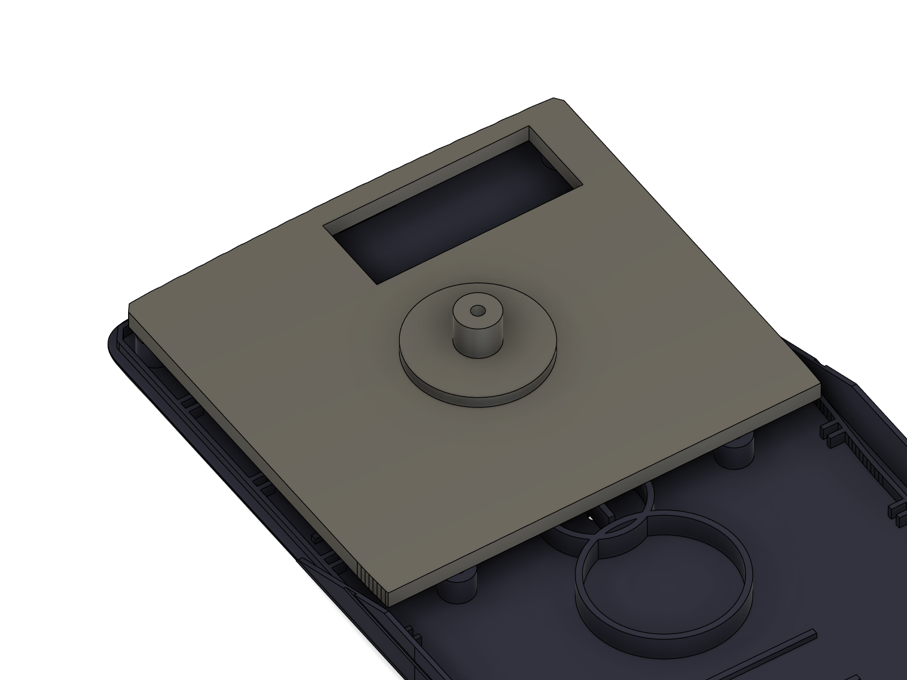
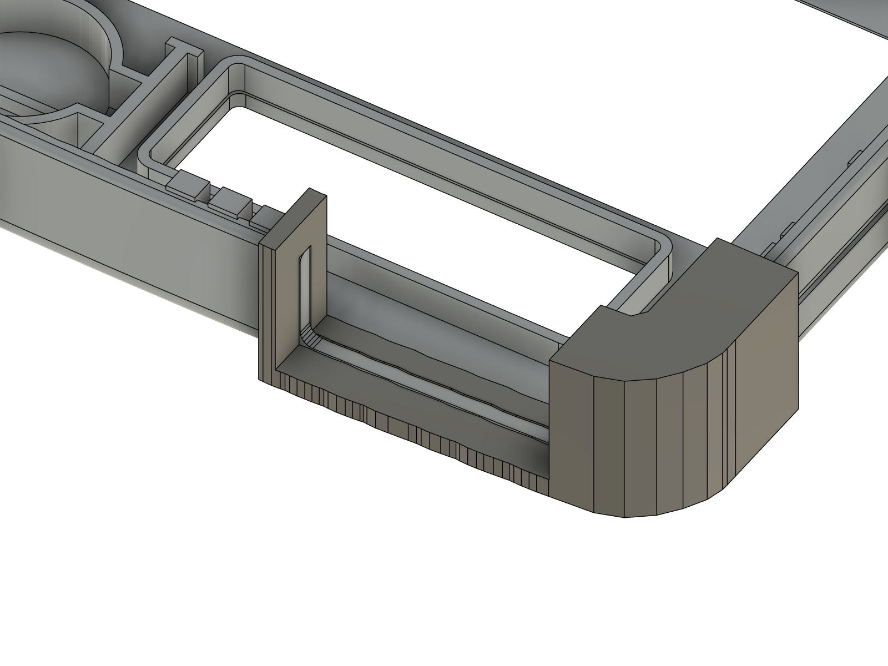
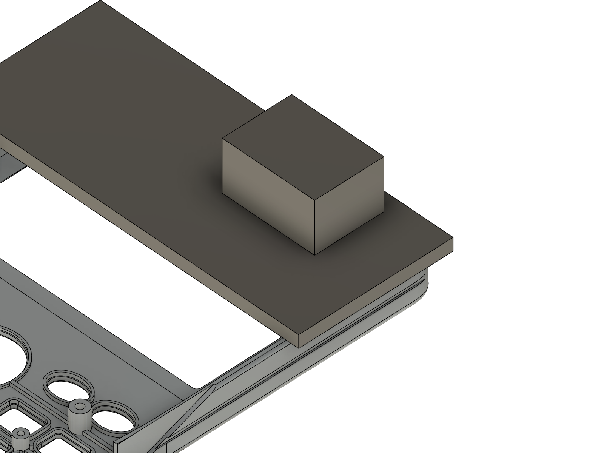

# Grinding jigs (3D-printed) for the donor fx-115ES shell

These jigs make the per-unit grinding faster and the same every time. Estimated hand time per unit drops from
**≈ 25–34 min freehand to ≈ 9–11 min** (details: `../final_assembly/battery_upgrade.md`, section 3).
They were modelled **in place on the rev D shell**, then checked in Fusion: each jig has **0 mm³ overlap** with the part
it sits on and rests on it with 0.0 contact (`jigs_check.json`).

| File | Jig | Used for | Print |
| --- | --- | --- | --- |
| `A_back_cover_plate.stl` | **A: back-cover plate** | zones 1 (solar box) + 2 (rib B), and holding A2 | PETG/PLA, 0.2 layers, 4 walls; print with the pins pointing UP |
| `A2_camera_drill_bush.stl` | **A2: camera drill bush** | zone 3 (7 mm camera window), the 2 mm pilot | flange down, 100 % infill round the hole |
| `A3_depth_gauge_7_2.stl` | **A3: depth gauge, 7.2 mm** | sets the Dremel router bit for A | flat |
| `B_magnet_notch_saddle.stl` | **B: magnet-notch saddle** | zone 5 (+ 5b lip) in the grinding guide (U-notch 21.5 × 7.95 in the top wall) | bridge face down, supports off |
| `C_LR44_trim_sled.stl` | **C: LR44 trim sled** | battery upgrade only: holder tips cut 1.9 mm | knob down |

Rebuild / re-export (Fusion open, final assembly built with `python ../build_final_assembly.py new shell grind pcb parts mask`):
```
python ../fusion_run.py build_jigs.py stage=build      # builds component "Jigs", checks, exports the STLs + renders
python ../fusion_run.py build_jigs.py stage=remove
```
All sizes are parameters at the top of `build_jigs.py`; printed fit clearance against the shell is 0.15 mm.

---

## A + A2 + A3: back-cover plate (solar box, rib B, camera window)



**What it is:** a 3 mm plate shaped like the inside of the navy back cover (0.8 mm inside its lip, from the top end
down to 12 mm above the centre line). It **rests on the 4 upper screw bosses** (tops at Z 5.4) and registers with
**four Ø2.0 × 3 mm pins in the bosses' Ø2.2 screw holes** (corner L/R, mid L/R). It has two openings:
- **solar-box window** = the zone 1 outline exactly (front X −4.8…29.8, Y 62.1…75.7, i.e. the frame + grid + 0.8);
  on the part that is the outer frame (6.3–19.3 mm down from the back cover's own top outer edge, straight down at
  the middle of the box) plus about 0.3 mm all round;
- **Ø16 hole** on the camera centre (front X 0, Y 43.84 = 38.0 mm down from the back cover's own top outer edge, on
  the centre line; datums as in the grinding manual, 2026-10-10). It also covers the rib B zone (rib B runs through the camera centre).

**Router depth:** the plate's top is Z 8.4, the floor's top Z 1.0. Stand the Dremel router base (Dremel 335 plunge
attachment or similar) on **A3**, plunge until a **3.2 mm flat-end straight bit** touches the bench, and lock it.
The bit now ends **7.2 mm below the base**, i.e. **0.2 mm above the floor** when the base rides on plate A.

**Steps (≈ 4.5–6.5 min per back cover):**
1. Drop A into the back cover (pins into the 4 boss holes).
2. Solar box: run the router inside the window. The bit shank against the window wall is the fence. Then remove A
   and sand the 0.2 mm skin flat with a sanding block (the floor stays 1.0 mm).
3. Rib B: router inside the Ø16 hole across the rib (it takes 16 mm of rib instead of the 14 mm minimum; fine).
   Scrape the last 0.2 mm off with a flat chisel blade. The camera has to sit flat on the floor.
4. Camera window: put **A2** into the Ø16 hole (flange on top), drill **Ø2.0 straight down** through the bush, remove the
   jigs, then open the hole **from the outside with a step drill to 7 mm** (it centres on the pilot). Deburr.

## B: magnet-notch saddle



**What it is:** a saddle that clips over the silver faceplate's **top wall** with the faceplate face down on the bench.
- **Bridge** (3 mm) rests on the rim (the parting-line face).
- **Outer leg** (3 mm) hugs the outside of the top wall and **wraps round the right-hand top corner** down to front Y 68.
  That sets the X position; no measuring.
- **Inner leg** (2 mm) hugs the inside of the wall between the comb snap tabs (it starts at X 10, they end at X 9.5) and
  the corner screw post.
- **Window** = the U-notch: 21.5 wide, centred at front X 22.5 (6.4–27.9 mm in from the right outer edge),
  **7.95 deep from the rim**.

**Steps (≈ 4–5 min):** clip B on. Saw down both window edges with a fine razor saw, to the window bottom. Cut the
bottom with flush cutters and file flat to the window's bottom edge (light strokes: PLA wears). Round the two inner
corners (r 1). Then cut the **navy back cover's lip** behind the notch to the same width with two snips (≈ 0.5 min).

## C: LR44 trim sled (battery upgrade only)



**What it is:** an 84 × 35.6 × 3 mm sled that rides on the faceplate rim (wider than the faceplate, so it always spans
both side walls), with a **tongue** under it over the LR44 holder and a knob on top. Fill the tongue with **P120
sandpaper on double-sided tape (≈ 0.6 mm in total)**. The abrasive then ends exactly **5.5 mm below the rim** (Z 7.0).
The tongue is 2.5 mm smaller than the zone in X and 1.5 mm in Y, so you scrub ±2.5 / ±1.5 mm and cover the whole
holder. A relief clears the comb snap teeth at the top.

**Steps (≈ 1–1.5 min):** scrub with small strokes until the sled sits flat on the rim at both side walls. Blow off the
dust. The holder now ends 1.9 mm lower (3.6 mm tall). Nothing else of the faceplate is inside the tongue's reach:
the solar frame stops 1.1 mm short of the abrasive.

---

## Time summary (per unit, estimates)

| Zone | Freehand | With jig |
| --- | --- | --- |
| 1 solar box | 8–12 min | 3–4 min |
| 2 rib B | 2 min | 0.5–1 min |
| 3 camera window | 4–5 min | 1–1.5 min |
| 5 + 5b magnet notch (+ lip) (grinding-guide numbers) | 10–15 min | 4–5 min |
| **Total today** | **≈ 25–34 min** | **≈ 9–11 min** |
| 4a LR44 trim (optional, battery upgrade only; the guide's zone 4 = cup kept) | 4–6 min | 1–1.5 min |
| 6 side-wall relief (only if the paper template won't drop in on the solar-window side; no jig: a needle file, 35 mm of a 1 mm rib) | 3–5 min | — |

Print the jigs in PETG if you can: PLA softens where the Dremel bit rubs the window walls. Check jig A's window walls
after ~20 units and reprint when they're worn.
