# fx-115ES shell replica (unbranded)

> **Stage 14 note:** the fit-check lines about cutting the LR44 cup are superseded: the battery lies on the back-cover floor, so the cup stays. See `../../FINAL_STATUS.md`.

A 3D model of the Casio fx-115ES calculator case, made in Fusion 360 from your caliper readings
(two batches: stage 10 and `hardware/measurements_2026-10-03.md`), your photos and the key positions
on the KiCad board. It has **no logo, no model name and no key labels**. It is for checking fit (will
our board, display and camera fit the real shell?) and as a starting point for a printed case.

**Rev C2 (2026-10-05):** the split between the two body parts now follows Nirav's photos: the **silver faceplate** is deep only in the screen section (it forms the top wall) and is a faceplate with a short skirt round the keypad and the bottom end; the **navy back cover**'s walls rise along a ramp from the small ring to the big ring and form the side walls round the keypad and the bottom end. Proper silver / navy colours. The placeholder slide cover is replaced by the **navy slide case** (a separate part, stored over the face here; guessed sizes). A shallow rail groove along both long sides is a guess (no photo shows one). Photo-by-photo notes: `photo_notes.md` (rev C section). Interference: 0 (with the case on).

**Rev B (2026-10-03):** rebuilt on the second batch of caliper readings. Main changes: the thickness
is now 11.8 at the top part and 11.3 at the keypad (it was 13.8, wrong); the board's component side is
6.0 above the inside of the back floor (D4) and 5.5 below the front shell's rim (D1), so the parting line is
1.5 from the back (rev B2, from Nirav's answers); the posts are placed from C8/C9/C10/C15; the side-wall stubs, the wire holders,
the LR44 cup and the 4 × 2 solar box are modelled at their measured sizes; rib and ring heights come
from D13. A new **fit check** puts our real PCB (STEP) into the replica and lists every collision
(`fitcheck_report.md`).

| Front | Back | Exploded |
| --- | --- | --- |
| 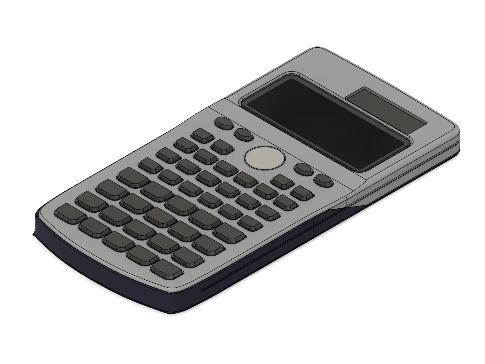 | 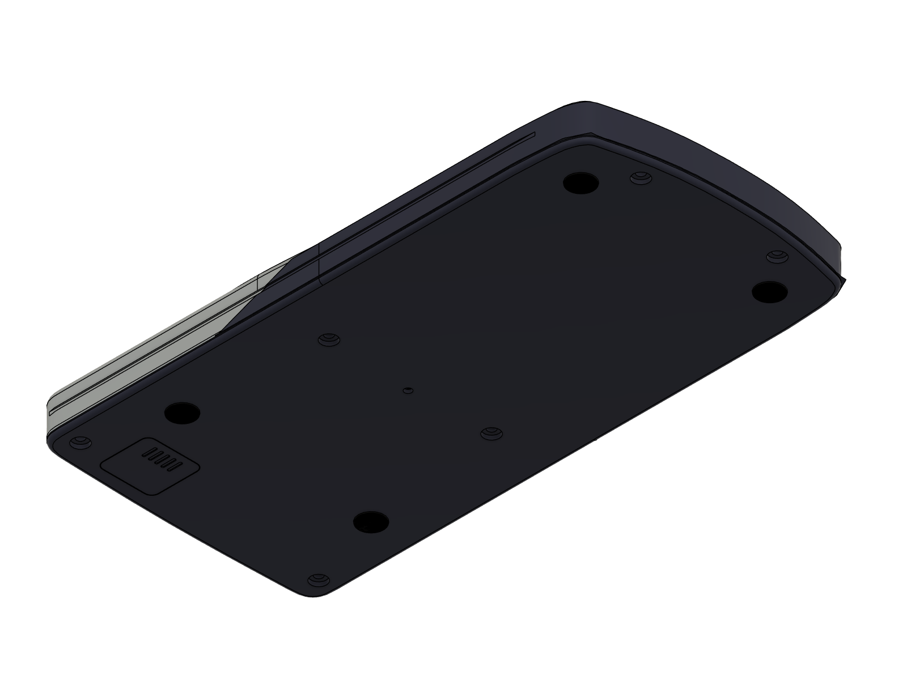 | 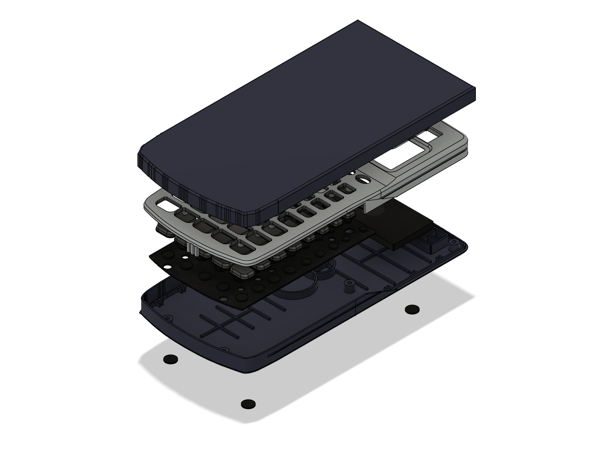 |

| Side (split line ramps up along the keypad) | Other side | With the slide case (stored) |
| --- | --- | --- |
| 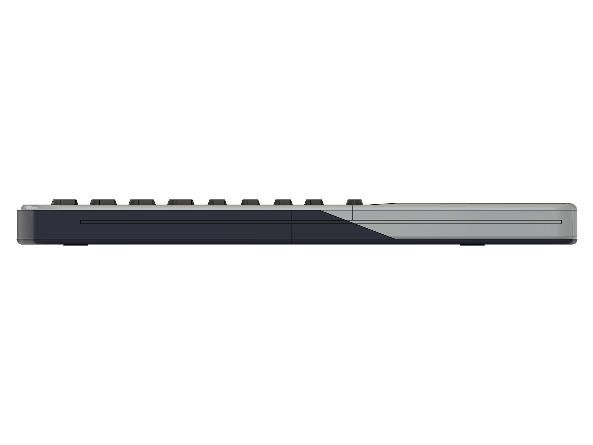 | 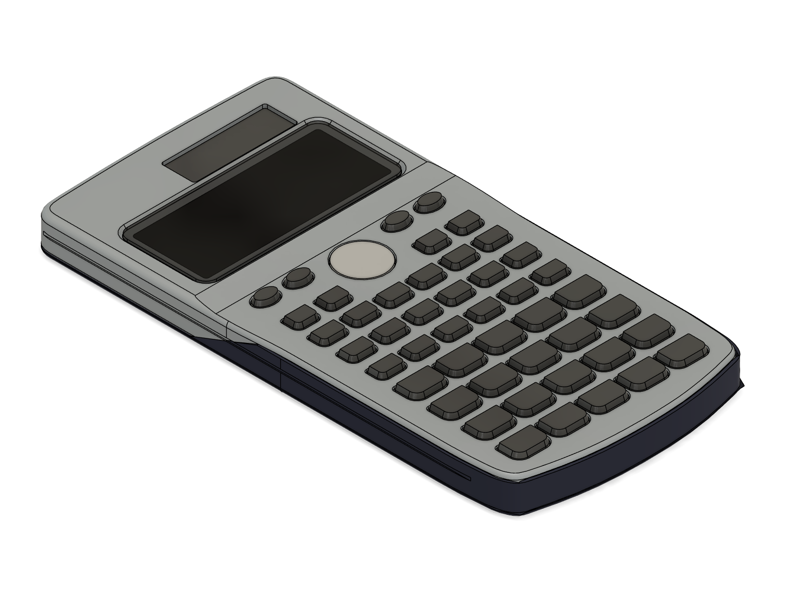 | 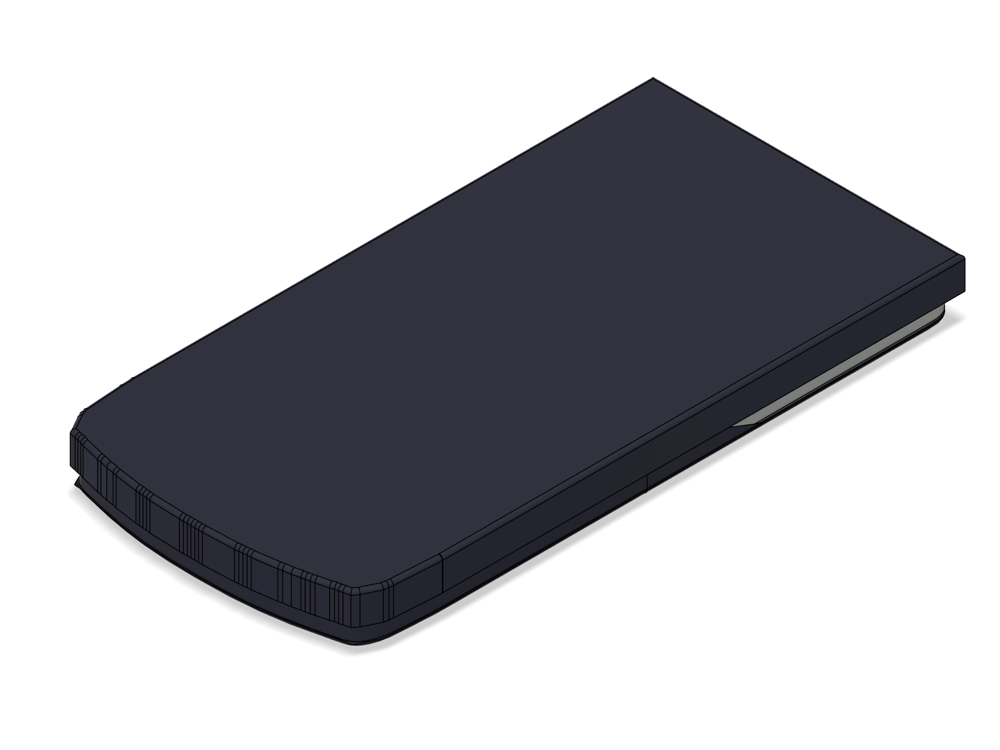 |

| Inside the front shell | Inside the back cover | Side (the face steps up 0.5 at the display) |
| --- | --- | --- |
| 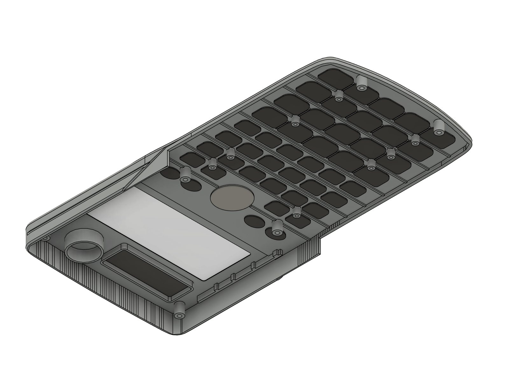 | 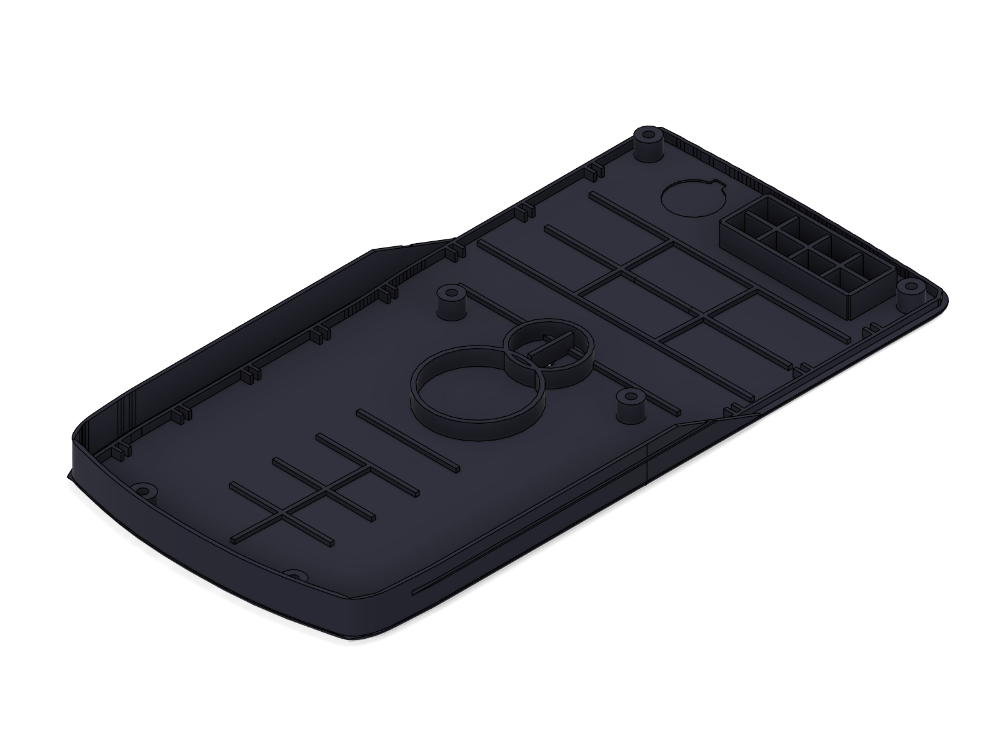 |  |

| Our PCB in the back cover | Cut through the screen section, with our PCB | Close-up of the cut |
| --- | --- | --- |
| 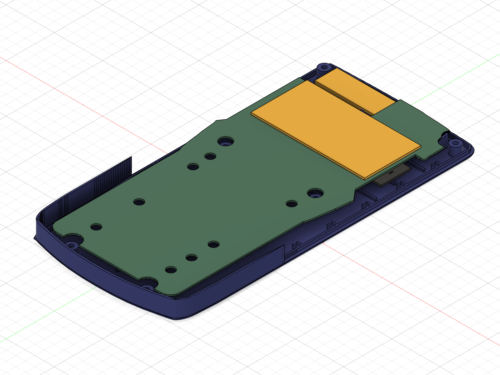 | 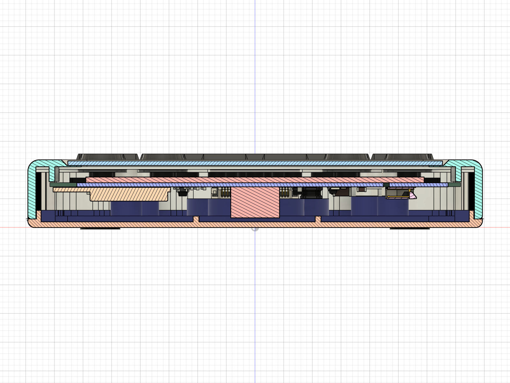 | 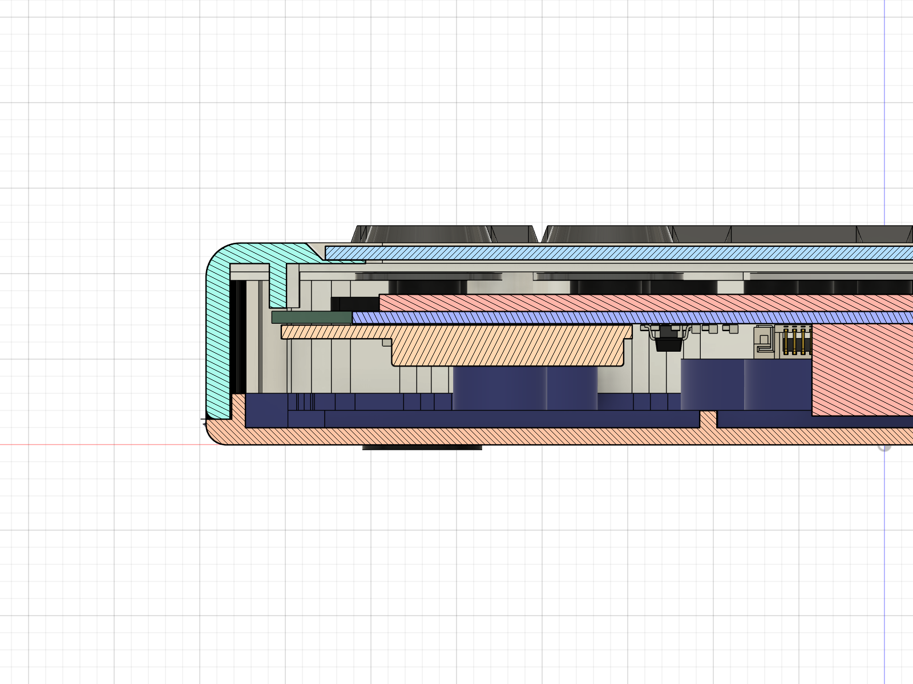 |

More pictures in `renders/` (straight front/back/side views, the slide cover, a close-up, a lengthwise cut).

## What is in the model

| Part (Fusion component) | What it is |
| --- | --- |
| Front shell | Silver top half: face (11.8 at the display, 11.3 at the keys, with a ramp between), display window in a bevelled recess, solar-cell through-window with a rib frame behind it, 46 key openings (tab-shaped like the real ones, ellipses for SHIFT/ALPHA/MODE/ON, round REPLAY hole), 6 screw posts (Ø3.85, pilot hole), 8 locating posts (Ø2.9, bored), the 4.7 mm wall beside the screen (skin + wire channel + inner rib) with 3 stubs and 1 wire holder per side, the LR44 cup, ribs between the key rows and a collar round each key hole underneath. |
| Back cover | Navy tray: 1.0 floor, rim, a lip that locates inside the front shell, tray walls that come up round the front shell in the keypad section, 6 screw bosses with counterbores, rib grid / two rings / lower ribs (D13 heights), the 4 × 2-cell solar box, short ribs along the inside of the side walls, the round LR44 hole in a shallow recess, the small centre hole, pockets for 4 feet. |
| Keycaps | 47 separate caps (46 keys + REPLAY), each with a skirt at the bottom that stops it falling out. No labels. |
| Keymat | Board-sized rubber sheet lying on the board, one dome per key (top 1.5 above the contact, D9), holes for the posts. |
| Window lens | Clear window in the bezel recess. |
| Solar cell (dummy), Battery lid, Rubber feet | Small parts. |
| Slide case (stored) | The navy slide-on hard case over the face (open end at the display end, closed end at the key end; lips ride in the side grooves). Sizes are guesses (not measured). The final assembly also has it on the back (in use). |
| Reference - Casio board (C6), Reference - LCD (dummy) | Only for checking fit; not exported as STL. LCD: 68 × 28 × 3.75 (D8), fits between the stubs. |
| Fit-check - PCB, Fit-check - missing parts | Only after `fitcheck`: our board from `hardware/fab/ai_calc_board.step`, plus yellow boxes for parts the STEP has no model for. Never exported. |

**Interference check (replica only):** 60 bodies, 0 overlaps (Fusion's own check and a second
pairwise check; `interference.txt`).

## Fit check: our PCB in the shell

```bash
python build_fx115es_replica.py fitcheck fitcheck_shots
```

Run it after `all` (or on the open replica document). It imports `hardware/fab/ai_calc_board.step`,
turns it over (the KiCad top view is seen from the back cover, so F.Cu parts face the back cover),
puts the key side at Z = 6.3 (D1) and checks every board body and part against the front shell,
back cover, keymat, battery lid and solar cell. It also reads `hardware/kicad/ai_calc.kicad_pcb`
(read only) for reference names, the holes, Edge.Cuts and the keep-outs, and adds boxes for the
ESP32-S3 module, the QFN, the camera module, the LiPo and the e-paper glass, which are not in the STEP.
Results, with the STEP timestamp: **`fitcheck_report.md`**. When the PCB agent regenerates the STEP,
just run the two stages again.

Summary of the run on the **stage-12 STEP (2026-10-03 23:02)** with the rev B2 stack-up (6.0 free behind
the board). The full list with depths, the 2D clearances and a stage-11 vs stage-12 table are in
`fitcheck_report.md`; `renders/section_camera_*` and `renders/section_j4_*` cut through the camera and J4.

- **Camera module (proxy, 5.4)**: bottom at Z 1.69, 0.69 above the floor, but it sits on upper rib B (1 high): 0.31 overlap. Grind that rib locally.
- **J4 (JST-PH, 5.5)**: bottom at Z 1.48 (0.48 above the floor) but inside the solar box: grind the box (it overlaps the box walls and grid over J4's full height).
- **J3** (pin socket) 1.0 into the solar-box grid; **U3, D1, Q2** 0.70 to 1.05 into the solar-box frame and grid; **LiPo** 3.2 into the solar box. The solar box has to go (as planned).
- **LiPo vs the front shell's LR44 cup** (D7, 5.5 high): 2.0 overlap. Cut the cup away.
- **Locating posts vs board holes:** H2 −0.54, H9 −0.29, H6 −0.11 (the C15 rows put them 0.8 to 1.2 below the board's holes). H1 is fine now (stage 12).
- Gone with rev B2: everything against the back floor itself, the big ring (D2), the wall ticks (U1), the screen-section inner rib and stubs (they stop above the board).
- The STEP board is 0.71 thick (KiCad 0.8), so real parts sit 0.09 closer to the floor than shown.

## Files

| File | What |
| --- | --- |
| `../build_fx115es_replica.py` | The script. All sizes are named parameters at the top. |
| `fx115es_replica.f3d` | Fusion archive with the full timeline (open it in Fusion and edit anything) |
| `fx115es_replica.step` | Whole assembly for any CAD program (replica only) |
| `stl/` | One STL per part; `stl/keycaps/` has one per key, `keycaps_all.stl` has all of them |
| `renders/` | Pictures (`fitcheck_*` and `section_screen_*` include our PCB) |
| `fitcheck_report.md` | Fit check of our PCB: every collision with location and depth, 2D clearances, STEP timestamp |
| `interference.txt`, `check_2d.txt` | Replica check results (`check_2d.txt` has the caliper cross-checks) |
| `photo_notes.md` | What each of your photos showed and what the model took from it |
| `geometry.json`, `board_snapshot.json` | Numbers the script works from (key and post x positions copied from the KiCad board once, so the replica does not change when the board is edited) |

## Rebuild

Fusion open, FusionMCPBridge add-in running, then in `hardware/enclosure`:

```bash
python build_fx115es_replica.py all
```

It opens a new Fusion document (your other designs are not touched), builds every part, runs
the interference check, exports and takes the pictures, in about 2 minutes. Then optionally
`python build_fx115es_replica.py fitcheck fitcheck_shots`. `python build_fx115es_replica.py` on its own
only checks the 2D layout (no Fusion needed). Single steps: `new front back keys parts check export
shots explode_shots fitcheck fitcheck_shots`. `export` removes the fit-check parts first, so the
exported files are the replica only.

## Every dimension and where it came from

Source: **caliper** = your measurements (ID from the measurement sheets), **spec** = Casio's published
size, **photo** = measured on your photos (about ±1 mm), **board** = KiCad board positions, **derived** =
worked out from other readings, **guess** = my estimate. Confidence: high / medium / low.

| Dimension | Value (mm) | Source | Confidence |
| --- | --- | --- | --- |
| Back cover length x width | 161.0 x 79.3 | caliper C3 | high |
| Front shell length | 159.9 (photo e59eff71 caliper shows 159.8) | caliper C1 | high |
| Front shell width, screen section | 79.3 | caliper C2 | high |
| Front shell width, keypad section | 77.4 (back cover's tray wall 0.8 + 0.15 gap each side) | caliper C5 + photos | medium |
| Outline shape | photo trace 88e03c27, long sides straightened to 79.3 (the trace was ±0.5 wavy), top corners ~5 mm | photo + calipers C2/C3/C9/C11/C15 | medium |
| Thickness, top part / keypad | 11.8 / 11.3 (+ 0.3 feet, + 1.5 keys) | caliper D10 | high |
| Stack-up | floor 1.0 + 6.0 + board 0.8 + 4.0 front side = 11.8; 3.5 front side at the keys = 11.3 | D5 + D4 + board + D10 | high |
| Face step | 0.5, ramp between Y 22 and 30 (between REPLAY and the bezel) | D10 + guess (position) | low |
| Board height | component (F.Cu) side at Z 7.0: 6.0 above the inside of the back floor, 5.5 below the front shell's rim | caliper D4, D1 (Nirav: D4 to the inside face, D1 from the rim) | high |
| Parting line | Z 1.5 from the outside of the back (back cover = shallow tray; tray walls up to 9.8 in the keypad section) | derived from D1 (rim to board 5.5) | high / low (tray walls) |
| Back cover floor | 1.0 | caliper D5 | medium (edges are rounded) |
| Space behind the board | 6.0 (board back to floor) | caliper D4 | high |
| Side wall beside the screen | 4.7 (1.4 skin + channel + 1.0 inner rib), from the plate down to Z 8.0 | caliper C4 + photos; Nirav: stops above the board | medium |
| Side-wall stubs | 3 per side at Y 37.3 / 47.5 / 56.0, tips 5.45 from the outside, from the plate (10.6) down to Z 8.0 (0.2 above the board), 1.5 wide | caliper C14 (depth), Nirav + photo 871567b6 (stop above the board), photo 2a97120d (Y), guess (width) | medium |
| Wire holder | 1 per side at Y 26, tip 5.5 from the outside, 2 wide | caliper C4, photo 2a97120d | medium |
| Tray wall (keypad section) | 0.8 | caliper C5 | medium |
| Front shell skin | 1.4 sides, 1.2 top, 1.6 bottom | derived from C11 (sides, top), guess (bottom) | medium / low |
| Face plate | 1.2 (plate underside 10.6 at the display, 10.1 at the keys) | guess; caps (domes to 9.6 + 0.4 flange) fit under it; D3 check: board line to the outside at the top edge 4.8 ("about 5") | medium |
| Edge round-over front / back | 2.0 / 1.2 | guess (photos) | low |
| Display window | 60.65 x 24.3, top edge 24.0 below the case top, centred | caliper C12, C13 | high |
| Bezel recess | window + 2.5 all round, 1.0 deep, 45° edge | photo 921b4503 + guess | medium |
| Solar window | 34 x 11 at (10.85, 67.3), through; rib frame 0.8 x 2.5 behind it | photo | medium / low |
| Key openings: number / function / row-2 / oval | 11.8x8.2 / 8.9x5.9 / 8.1x6.0 / 8.3x5.6 | measured on the shell (stage 10) | medium |
| Key opening corners (top / bottom) | 1.0/3.0 number keys, 0.8/2.0 others | photo aa09fe8a + guess | low |
| REPLAY opening | Ø15.4 | measured | medium |
| Key centres | KiCad board | board + photos | high |
| Key height above face | 1.5 (REPLAY 1.2) | guess | low |
| Keymat | sheet 0.8 on the board, dome tops 1.8 above the board (contact 0.3 + D9 1.5) | caliper D9 + guess | medium |
| LCD stack | LCD shield 6.8 to 10.55, level with the Casio board's back face (7.0) | D8 + photo 871567b6 | medium |
| LCD module | 68 x 28 x 3.75 | caliper D8 (thickness), photo fd923128 (width), guess (height) | medium / low |
| Screw posts | Ø3.85, pilot Ø1.7 | caliper C7 / guess | high / low |
| Locating posts | Ø2.9, bore Ø1.2 x 3 | caliper C7 / guess | high / low |
| Corner screw posts | (±34.05, 74.05): 68.1 apart, 8.05 below the top | caliper C9, C15 (C11 4.2 / 6.1 agree: 4.20 / 6.02) | high |
| Middle screw posts | (22.45, 13.0), (−24.05, 13.0): 46.5 apart | caliper C8, C15; centre from the mat photo | high (spacing) / medium (centre) |
| Bottom screw posts | (±19.5, −71.65): 39.0 apart | caliper C10, C15 | high |
| Locating posts H8/H10 | 42.3 apart, at the photo height | caliper C8 + photo | medium |
| Locating posts H4, H2/H9, H6, H13/H14 | x from the photo fit, y from C15 rows | caliper C15 + photo | medium |
| C15 reading convention | "to the outside of the holes" = case top to the far edge of the post's hole (pilot / bore); fits the photos to ≤ 1.05 | derived | medium |
| Back ribs and rings | positions photo 2f54d6c7; rings Ø16.8 / Ø24.8 | photo | medium |
| Rib / ring heights | grid 1, rings 4, lower ribs 1, vertical rib through the small ring 4 | caliper D13 (that rib: guess) | high / low |
| Solar box | 33 x 12 at the top right, 4 x 2 cells; frame 5.5, grid 5 high | caliper D6, D13, photo 050df9b7 | medium |
| LR44 cup (front shell) | Ø12.4 inside, 0.8 wall, 5.5 high | caliper D7 (height), photos | medium |
| Battery hole / recess | Ø12 hole with notch, 16 x 15 x 0.6 recess at (−18.3, 69.9) | photo + guess | low |
| Back screw bosses | Ø5.5 up to Z 5.4, Ø2.2 hole, Ø4.4 x 1.2 counterbore | guess | low |
| Feet | 4 x Ø7, 0.3 proud | guess | low |
| Casio board | 65.05 x 97.9 x 0.8 | caliper C6 | high |
| E-paper (fit check) | 59.0 x 29.2 x 1.0 | caliper P3 (thickness from the drawing) | high / medium |
| Split line on the long sides | rim (Z 1.5) in the screen section, ramp from Y 31 (small ring) to Y 8 (big ring), then Z 9.8 round the keypad + bottom | photos 2f54d6c7, 84e63d95, 050df9b7, 7c6e8116 (position) + guess (straight ramp, 9.8) | medium / low |
| Faceplate skirt (keypad section, bottom end) | silver part ends at Z 8.3 inside the navy wall | photos 76dd27d2, e82c982d (shape) + guess (depth) | low |
| Silver step-in (keypad) | 0.95 (navy wall 0.8 + 0.15), from Y 18 (under SHIFT/ALPHA) to full at Y -2 | photos 7c6e8116, 4e287737, e59eff71 | medium |
| Rail groove | 1.0 tall x 0.35 deep at Z 5.9-6.9, both long sides | guess (not in any photo) | low |
| Slide case | wall 1.0, floor 1.2, 0.3 clearance, lips 0.9 in the groove, open end at the top | guess + Casio manual (open end) | low |

Coordinates are front-view mm with (0, 0) at the KiCad board's reference point: X = 150 − x_kicad,
Y = 138.94 − y_kicad.

## Remaining guesses (the things that would make it exact)

1. **Side profile photo with a ruler:** how high the back cover's tray walls come up in the keypad section
   (9.8?), where the face steps from 11.3 to 11.8, edge round-overs, key height.
2. **Stub / inner rib bottom:** Nirav says they stop above the board; modelled 0.2 above it (Z 8.0). The
   exact height would tell how much room is left under them.
3. **Face-plate thickness** (calipers through a key hole) and the **back floor** away from the edge.
4. **A flatbed scan** of the face and of both insides: would replace every "photo" row above.
5. **Battery recess and lid**, the **centre hole**, the **feet**.
6. **Keycap** height and top shape; **slide cover** (not measured at all).

## Known simplifications

- Key tops are a straight bevel, not the real slightly curved shape.
- The inside of the front shell's top wall and the tray walls are built from short straight
  segments, so they show faint facet lines in close-ups (the outer surfaces are smooth).
- The face step is a straight ramp with a small round where it meets the edge round-over.
- The slide cover is a simple lid; the real one's grip is unknown.
- No screws are modelled.
