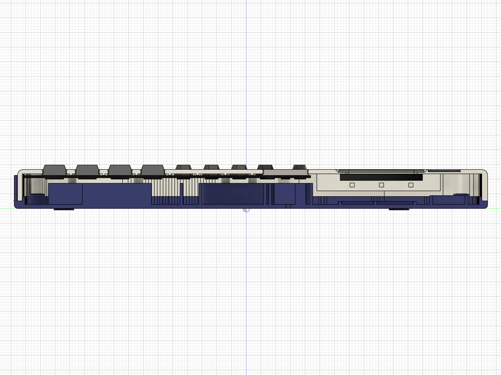

# fx-115ES shell replica (unbranded)

A 3D model of the Casio fx-115ES calculator case, made in Fusion 360 from your caliper readings,
your 23 photos and the key positions on the KiCad board. It has **no logo, no model name and no key
labels**. It is for checking fit (will our board, display and camera fit the real shell?) and as a
starting point for a printed case.

| Front | Back | Exploded |
| --- | --- | --- |
|  |  |  |

| Inside the front shell | Inside the back cover | Cut through the middle |
| --- | --- | --- |
|  |  |  |

More pictures in `renders/` (straight front/back/side views, the slide cover, a close-up).

## What is in the model

| Part (Fusion component) | What it is |
| --- | --- |
| Front shell | Silver top half: face with the display window in a bevelled recess, solar-cell window, 46 key openings (tab-shaped like the real ones, ellipses for SHIFT/ALPHA/MODE/ON, round REPLAY hole), 6 screw posts (Ø3.85) and 8 locating posts (Ø2.9), the thick side wall beside the screen with its inner rib, wire channel and 3 pins per side, ribs between the key rows and a collar round each key hole underneath. |
| Back cover | Navy tray: floor, rim, a lip that locates inside the front shell, tray walls that come up round the front shell in the keypad section (as in your photos), 6 screw bosses with counterbores, the rib grid / two rings / ribbed box from photo 2f54d6c7, short ribs along the inside of the side walls, the round LR44 hole in a shallow recess, the small centre hole, pockets for 4 feet. |
| Keycaps | 47 separate caps (46 keys + REPLAY), each with a flange that stops it falling out. No labels. |
| Keymat | Board-sized rubber sheet with one dome per key and holes for the posts (like photo 28bb9c4b). |
| Window lens | Clear window in the bezel recess. |
| Solar cell (dummy), Battery lid, Rubber feet | Small parts. |
| Slide cover | Optional hard cover, a placeholder (not measured). |
| Reference - Casio board (C6), Reference - LCD (dummy) | Only for checking fit; not exported as STL. |

**Interference check:** 60 bodies, 0 overlaps (Fusion's own check and a second pairwise check;
results in `interference.txt`).

## Files

| File | What |
| --- | --- |
| `../build_fx115es_replica.py` | The script. All sizes are named parameters at the top. |
| `fx115es_replica.f3d` | Fusion archive with the full timeline (open it in Fusion and edit anything) |
| `fx115es_replica.step` | Whole assembly for any CAD program |
| `stl/` | One STL per part; `stl/keycaps/` has one per key, `keycaps_all.stl` has all of them |
| `renders/` | Pictures |
| `interference.txt`, `check_2d.txt` | Check results |
| `photo_notes.md` | What each of your photos showed and what the model took from it |
| `geometry.json`, `board_snapshot.json` | Numbers the script works from (key and post positions copied from the KiCad board once, so the replica does not change when the board is edited) |

## Rebuild

Fusion open, FusionMCPBridge add-in running, then in `hardware/enclosure`:

```bash
python build_fx115es_replica.py all
```

It opens a new Fusion document (your other designs are not touched), builds every part, runs
the interference check, exports and takes the pictures, in about 2 minutes. `python build_fx115es_replica.py`
on its own only checks the 2D layout (no Fusion needed). Single steps: `new front back keys parts
check export shots explode_shots`.

## Every dimension and where it came from

Source: **caliper** = your measurements, **spec** = Casio's published size, **photo** = measured on
your photos (about ±1 mm), **board** = KiCad board positions (the key grid was checked against two
photos to ±0.5 mm), **guess** = my estimate. Confidence: high / medium / low.

| Dimension | Value (mm) | Source | Confidence |
| --- | --- | --- | --- |
| Back cover length x width | 161.0 x 79.3 | caliper C3 | high |
| Front shell length | 159.9 | caliper C1 | high |
| Front shell width | 78.4 max (79.3 measured: see open questions) | photo + caliper | medium |
| Outline shape (top arc, corners) | traced | photo 88e03c27 scaled to calipers | medium |
| Total thickness | 13.8 (13.3 body + 0.5 feet) | spec (fx-115ES) | medium |
| Side wall beside the screen | 4.7 (1.2 skin + channel + 1.0 inner rib) | caliper C4 + photos | medium |
| Tray wall (keypad section) | 0.8 | caliper C5 | medium |
| Front shell skin | 1.2 sides, 2.0 top, 1.6 bottom | guess | low |
| Face plate | 1.5 | guess | low |
| Parting line height / tray wall top | 2.6 / 11.3 from the back | guess | low |
| Edge round-over front / back | 2.0 / 1.2 | guess (photos) | low |
| Display window | 60.65 x 24.3, top edge 24.0 below the case top | caliper C12, C13 | high |
| Bezel recess | window + 2.5 all round, 1.0 deep, 45° edge | photo 921b4503 + guess | medium |
| Solar window | 34 x 11 at (10.85, 67.3) | photo | medium |
| Key openings: number / function / row-2 / oval | 11.8x8.2 / 8.9x5.9 / 8.1x6.0 / 8.3x5.6 | measured on the shell (stage 10) | medium |
| Key opening corners (top / bottom) | 1.0/3.0 number keys, 0.8/2.0 others | photo aa09fe8a + guess | low |
| REPLAY opening | Ø15.4 | measured | medium |
| Key centres | KiCad board | board + photos | high |
| Key height above face | 1.5 (REPLAY 1.2) | guess | low |
| Screw posts | Ø3.85, pilot Ø1.7 | caliper C7 / guess | high / low |
| Locating posts | Ø2.9 | caliper C7 | high |
| Corner screw posts | 4.2 from inside side wall, 6.1 from inside top wall → (±32.7, 73.2) | caliper C11 (agrees with photo within 1 mm) | high |
| Bottom screw posts | 39.0 apart, y -71.1 (15.5 from inside wall) | caliper C10 + board | high |
| Middle screw posts | (22.4, 12.7), (-24.0, 12.7) | photo of the mat | medium |
| Locating post positions | KiCad H2/H4/H6/H8/H9/H10/H13/H14 | photo-fitted (stage 10) | medium |
| Side-wall pins | 3 per side at y 36/46/56, 1.5 x 1.5 x 1.4 | photos (count/position), guess (size) | low |
| Back ribs and rings | positions from photo 2f54d6c7; rings Ø16.8 / Ø24.8 | photo | medium |
| Rib heights | keypad ribs/rings up to the board, screen-section ribs 1.0 | photo 84e63d95 + guess | low |
| Battery hole / recess | Ø12 hole with notch, 16 x 15 x 0.6 recess at (-18.3, 69.9) | photo + guess | low |
| Back screw bosses | Ø5.5, Ø2.2 hole, Ø4.4 x 1.2 counterbore | guess | low |
| Feet | 4 x Ø7, 0.5 proud | guess | low |
| Casio board | 65.05 x 97.9 x 0.8 | caliper C6 (thickness guess) | high |
| Keymat | board size, 0.8 thick | photos + guess | medium |
| Slide cover | 1.2 thick, 0.25 clearance | guess | low |

Coordinates are front-view mm with (0, 0) at the KiCad board's reference point: X = 150 − x_kicad,
Y = 138.94 − y_kicad.

## Measurements that would make it perfect

1. **One straight-on photo of the long side with a ruler** (or calipers): parting-line height,
   tray-wall height, edge round-overs, how much the keys stick up. This is the biggest unknown.
2. **Front shell width** at the screen and at the keypad, to settle C2 (front or back?).
3. **Face-plate thickness** (calipers through a key hole) and **back-cover floor thickness**
   (through the battery hole).
4. **A flatbed scan** of the face and of the back cover inside (scale is exact on a scanner):
   would replace every "photo" row above.
5. **Side-wall pins (C14):** diameter, length, height above the rim.
6. **Battery recess and lid**, the **centre hole**, and **feet** position/size.
7. **Rib heights** in the back cover (screen-section grid, rings, keypad ribs).
8. **Key cap**: height and top shape of one number key and one function key.
9. **Slide cover**: length, width, height, how it grips.

## Known simplifications

- Key tops are a straight bevel, not the real slightly curved shape.
- The inside of the front shell's top wall and the tray walls are built from short straight
  segments, so they show faint facet lines in close-ups (the outer surfaces are smooth).
- The slide cover is a simple lid; the real one's grip is unknown.
- No screws are modelled.
